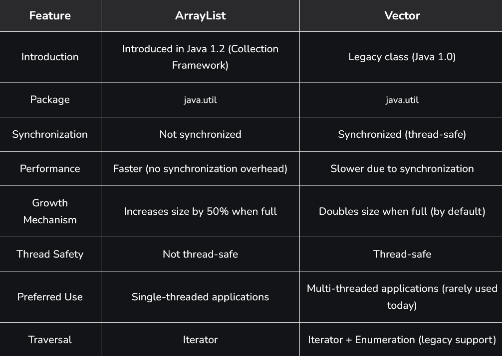
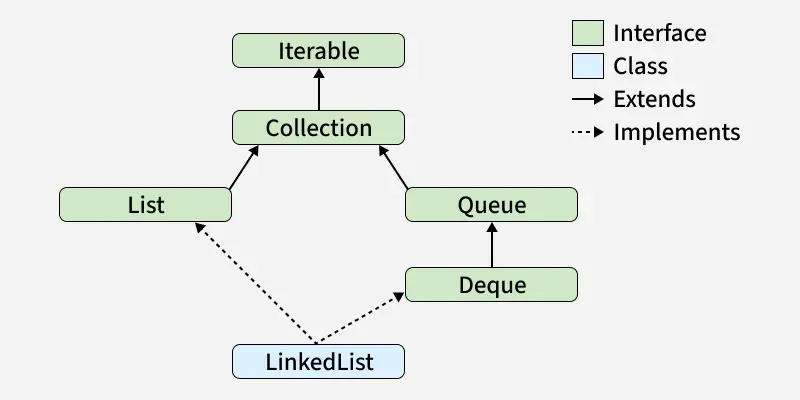

# Part - 4 - Array-List

Every collection class by default implements Serializable and Cloneable interfaces to allow objects to be held  and transferred across networks.

**Random Access** :
Only ArrayList and Vector implements the RandomAccess marker interface, which allows for fast retrieval of any random element.

**Vector vs ArrayList** : Vector and ArrayList are dynamic array implementations in Java used to store elements that can grow or shrink in size. Both are part of java.utl.package and provide indexed access to elements.
- Both allow duplicate elements and maintain insertion order.
- Both provide fast index-based access to elements.
- They differ mainly in performance and thread-safety behavior.

**ArrayList** :

ArrayList is a resizable array implementation of the List interface that allows dynamic storage of elements. It is widely used because it provides fast random access and flexible size management.
- Maintains insertion order of elements.
- Not synchronized, so its not thread-safe.
- Grows dynamically when elements are added.

```
Syntax : List <DataType> listName = new ArrayList<>();
```

**Vector** : 
Vector is a dynamic array implementations in Java that grows automatically when elements are added. It is similar to ArrayList but it is synchronized and thread-safe.
- Vector is a legacy class introduced in Java 1.0 before the Collection Framework.
- Maintains insertion order of elements.
- Slower than ArrayList due to Synchronization overhead.
```
Syntax : Vector<DataType> vectorName = new Vector<>();
```
**ArrayList vs Vector** :



**LinkedList** : 

LinkedList is a part of the Java Collections Framework and is present in the java.util.package. It implements a doubly linked list where elements are stored as nodes containing data and references to the previous and next nodes, rather than in contiguous memory locations.
- The size of LinkedList can grow or shrink dynamically at runtime.
- Maintains the order in which elements are inserted.
- Multiple duplicate elements are inserted.
- LinkedList is not thread-safe by default, It can be synchronized using Collections.synchronizedList().
- Provides better performance than ArrayList for insertion and deletion operations, especially at the beginning or middle.

```
public class Test{
    public static void main(String[] args){
        //Create a linkedList
        LinkedList<String> l = new LinkedList<String>();

        l.add("One");
        l.add("two");
        l.add("three");
        l.add("four");

        Sop(l);
    }
}

Output
[One, Two, Three, Four]
```

**Note** : LinkedList nodes cannot be accessed directly by index, elements must be accessed by traversing from the head.

**Hierarchy of LinkedList**: 

It implements the List and Deque interfaces, both of which are sub-interfaces of the Collection Interface.



**Constructors of LinkedList** : 

In order to create a LinkedList, we need to create an object of the LinkedList class. The LinkedList class consists of various constructors that allow the possible creation of the list.

1. **LinkedList()** :
   This constructor is used to create an empty linked list. If we wish to create an empty LinkedList with the name list.
   ```
   LinkedList list = new LinkedList();
   ```
2. **LinkedList(Collection C)** : 
   This constructor is used to create an ordered list that contains all the elements of a specified collection, as returned by the collection's iterator.
   ```
   LinkedList list = new LinkedList(C);
   ```

**Operations on LinkedList** :

1. **Adding Elements** :
   With the help of add() method we can add elements to a LinkedList. this method can perform multiple operations based on different params
   - **add(Object)** : This method is used to add an element at the end of the LinkedList.
   - **add(int index, Object)** : This method is used to add an element at a specific index in the LinkedList.
   ```
   public class Test{
    public static void main(String[] args){
        LinkedList<String> ll = new LinkedList<>();

        ll.add("Geeks");
        ll.add("For");
        ll.add(1,"Geeks");

        Sop(ll);
    }
   }

   Output
   [Geeks, For, Geeks]
   ```

2. **Update Elements** : 
   With the help of set() method we can update an element in a LinkedList. This method takes an index and the updated element which needs to be inserted at that index.
   ```
   public class Test{
    public static void main(String[] args){
        LinkedList<String> ll = new LinkedList<>();

        ll.add("Geeks");
        ll.add("For");
        ll.add(1,"Geeks");

        Sop("Initial LinkedList " + ll);

        ll.set(1, "For");

        Sop("Updated linkedList " + ll);
    }
   }

   Output
   Initial LinkedList [Geeks, Geeks, Geeks]
   Updated LinkedList [Geeks, For, Geeks]
   ```

3. **Removing Elements** :
   Removes the first occurrence of the specified element from list, if it exists.
   - **remove(Object)** : Removes the first occurrence of the specified object from the LinkedList.
   - **remove(int index)** : Removes the element at the given index and shifts subsequent elements.
   ```
   public class Test{
    public static void main(String args[]){
        LinkedList<String> ll = new LinkedList<>();

        ll.add("Geeks");
        ll.add("For");
        ll.add(1,"Geeks");

        Sop("Initial LinkedList " + ll);

        ll.remove(1);

        Sop("After the index removal " + ll);

        ll.remove("Geeks");

        Sop("After the object removal" + ll);
    }
   }
   Output

    Initial LinkedList [Geeks, For, Geeks]
    After the Index Removal [Geeks, Geeks]
    After the Object Removal [Geeks]
    ```

4. **Iterating a LinkedList** :
   There are multiple ways to iterate through LinkedList. The most famous ways are by using the basic for loop in contribution with a get() method to get the element at a specified index and the advanced for-loop.
   ```
   public class Test{
    public static void main(String args[]){

        LinkedList<String> ll = new LinkedList<>();
        
        ll.add("Geeks");
        ll.add("Geeks");
        ll.add(1, "For");

        for(int i = 0; i< ll.size(); i++){
            Sop(l.get(i) + " ");
        }

        Sop();

        // Using the for each loop or using iterator is recommended practice
        for(String str : ll){
            Sop(str + " ");
        }
    }
   }
   Output

    Geeks For Geeks
    Geeks For Geeks
    ```