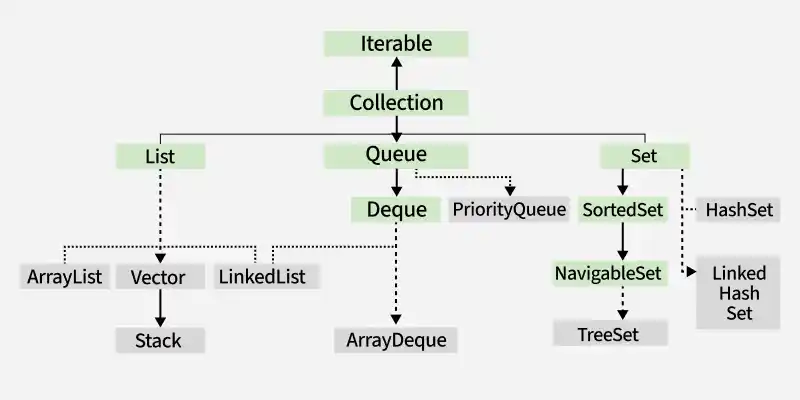
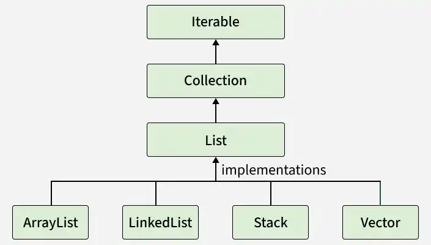
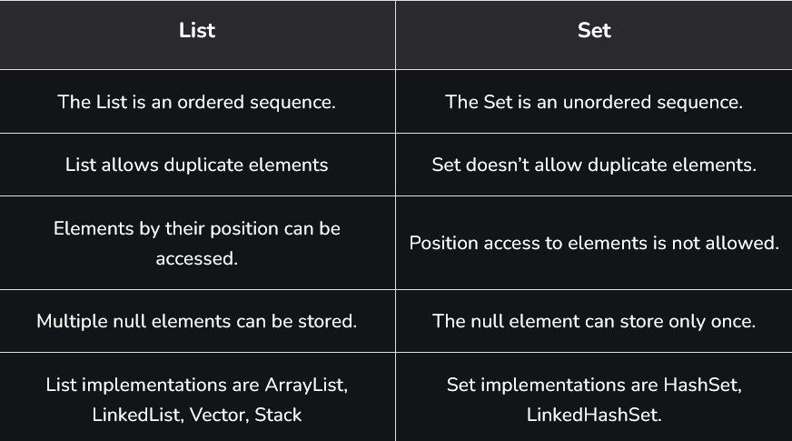
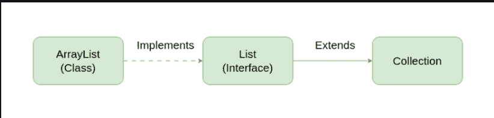

# Part - 2, 3 - Collections Interface.

The collection interface is the root of the Java Collection Framework, defined in the java.util.package. It represents a group of individual objects as a single unit and provides basic operations for working with them.
- Represent a group of objects as a single unit.
- Dynamic in size (can grow or shrink).
- Provide simple methods like add(), remove() and clear().
- Stores elements of a specific type using generics.

**Declaration** :
```
public interface Collection<E> extends Iterable<E>

Here : E represents the type of elements stored in the collection.
```
**Object Creation of Collection Interface** :

```
Collection<String> fruits = new ArrayList<>();
```

**Example** :
```
public class Test{
    public static void main(String[] args){
        Collection<String> fruits = new ArrayList<>();

        fruits.add("Apple");
        fruits.add("Banana");
        fruits.add("Mango");

        fruits.remove("Banana");


        Sop("After removal" + fruits);
    }
}

Output

After Removal: [Apple, Mango]

```

We cannot create an object of an interface directly. Instead we create an object of the ArrayList class that implements the interface and assign it to the interface reference.

**Hierarchy of Collection Interface** : 



**Types of Collection interface** :

1. **List** : 
   
   - List represents an ordered collection that allows duplicates.
   - Elements can be accessed by index.
   - Implementing classes : ArrayList, LinkedList, Vector, stack.
   
**Declaration** :
```
public interface List<E> extends Collection<E>
```
2. **Set** : 
   
    - Set represents an unordered collection with no duplicate elements.
    - Implementing Classes : HashSet, TreeSet, LinkedHashSet, EnumSet

**Declaration** :
```
public interface Set<E> extends Collection<E>
```
3. **SortedSet** : 
   
    - SortedSet extends Set and maintains elements in a sorted order.
    - Provides methods to handle range-based operations.
    - Implementing Class : TreeSet.

**Declaration** :
```
public interface SortedSet<E> extends Set<E>
```

4. **Navigable Set** : 
   
    - NavigableSet extends SortedSet and provides navigation methods like lower(), floor(), ceiling(), and higher().
    - Implementing Class : TreeSet.

**Declaration**  :
```
public interface NavigableSet<E> extends SortedSet<E>
```

5. **Queue** :

   - Queue represents a collection following FIFO (First-in-First-Out) order.
   - Implementing Classes : PriorityQueue, ArrayDeque, LinkedList.

**Declaration** :
```
public interface Queue<E> extends Queue<E>
```

**Operations on Collection Objects** :

The collection interface provides several operations to manipulate data efficiently .

1. **Adding Elements** :
   We can add elements using the add(E e) method for a single element or addAll(Collection c) to add multiple elements.

    ```
    public class Test{
        public static void main(String[] args){
            //Creating a collection using arraylist
            Collection<Integer> numbers = new ArrayList<>();

            //Adding elements.
            numbers.add(10);
            numbers.add(20);
            numbers.add(30);
            

            //Adding another collection
            Collection<Integer> moreNumbers = new ArrayList<>();

            moreNumbers.add(40);
            moreNumbers.add(50);

            numbers.addAll(moreNumbers);

            Sop("All elements : " + numbers);
        }
    }

    Output

    After adding elements: [10,20, 30, 40, 50]
    ```

2. **Removing Elements** :

    Elements can be removed using remove(E e) or removeAll(Collection c) methods
    ```
    public class Test{
        public static void main(String[] arg){
            Collection<String> fruits = new ArrayList<>();
            fruits.add("Apple");
            fruits.add("Banana");

            Sop("Initial Collections :" + fruits);

            fruits.remove("Mango");
            Sop("After removing mango" + fruits);

            //Removing all elements from another collection
            Collection<String> toRemove = new ArrayList<>();
            toRemove.add("Apple");
            toRemove.add("Banana");

            fruits.removeAll(toRemove);
            Sop("After removal(): " + fruits);
        }
    }

    Output

    Initial Collection: [Apple, Banana, Mango, Orange]
    After removing Mango: [Apple, Banana, Orange]
    After removeAll(): [Orange]
    ```

3. **Accessing Elements** :

    Although the Collection interface doesn't provide index-based access, its sub-interface List(implemented by ArrayList) allows retrieving elements using the get(int index) method.
    ```
    public class Test{
        public static void main(String[] args){

            //Using list reference for index-based access
            List<String> colors = new ArrayList<>();
            colors.add("Red");
            colors.add("Green");
            colors.add("Blue");

            Sop("Color List: "+ colors);

            //Accessing elements by index.
            String firstColor = colors.get(0);
            String lastColor = colors.get(colors.size()-1);

            Sop("First color", firstColor);
            Sop("Last color", lastColor);
        }
    }
    Output

    Colors List: [Red, Green, Blue]
    First Color: Red
    Last Color: Blue

    ```
4. **Iterating over a collection** :

   To iterate over a collection we used Different types of cursor.
     
    1. **Iterator** :
       
        - The iterator interface allows traversal in one direction (forward).
        - YOu can safely remove elements during iteration using remove().
        ```
        public class IteratorEg{
            public static void main(String[] args){
                Collection<String> fruits = new ArrayList<>(Arrays.asList("Apple", "Banana", "Mango"));

                Iterator<String> it = fruits.iterator();
                while(it.hasNext()){
                    String fruit = it.next();
                    if(fruit.equals("Banana")){
                        it.remove();
                    }
                }
                Sop(fruits);
            }
        }

        O/P -> [Apple, Mango]
        ```
    
    2. **ListIterator** :

       - ListIterator extends Iterator and is available for list implementations (ArrayList, LinkedList).
       - Supports bidirectional traversal (forward and backward).
       - Allows adding, removing and replacing elements during iteration.
       ```
       public class ListIteratorEg{
        public static void main(String[] args){
            List<String> colors = new ArrayList<>(Array.asList("Red", "Green", "Blue"));

            ListIterator<String> listIt = colors.listIterator();

            //Forward traversal
            Sop("Forward :");
            while(listIt.hasNext()){
                Sop(listIt.next() + " ");
            }

            Sop("\n Backward: ");
            while(listIt.hasPrevious()){
                Sop(listIt.previous() + " ");
            }
        }
       }

        Output
        Forward: Red Green Blue
        Backward: Blue Green Red
        ```

**Removing During Iteration** :

- Using Iterator.remove() or ListIterator.remove() is the correct way to remove elements while iterating.
- Directly using collection.remove(element) inside a loop will throw ConcurrentModificationException.

**Note** :

- equals() determines if two elements are logically equal.
- hashCode() provides a hash value for efficient storage and lookup.

**List Interface** :

The list interface in Java extends the Collection interface and is part of the java.util.package. It is used to store ordered collections where duplicates are allowed and elements can be accessed by their index.
- Maintains insertion order.
- Allows duplicate elements.
- Supports bidirectional traversal using ListIterator.

**Syntax** :
```
List<Type> list = new ArrayList<Type>();
```

**Declaration** :
```
public interface List<E> extends Collections<E>{}
```

```
class Test{
    public static void main(String[] args){

        //Creating a list of string using ArrayList
        List<String> li = new ArrayList<>();

        //Adding elements
        li.add("Java");
        li.add("Python");
        li.add("DSA");

        Sop("Elements of list are :" );

        //Iterating through list
        for(String s : li){
            Sop(s);
        }
    }
}

Output

Elements of List are:
Java
Python
DSA

```

**Hierarchy of List Interface** :



The common implementation classes of List interface are :

- **ArrayList** : It is implemented using resizable array, offers fast random access but slower insert/delete.
- **LinedList** : It is implemented using Doubly-linked list, efficient for frequent insertions and deletions.
- **Vector** : It is implemented using Legacy synchronized dynamic array, thread-safe but slower.
- **Stack** : It is implemented using LIFO (Last-In-First-Out) subclass of Vector for stack operations.

**Java List Operations** :

List can be used only with a class that implements this interface.

1. **Adding Elements** : 

    To add an element to the list, we can use the add() method. This method is overloaded to perform multiple operations based on different params
   - **add(Object o)** : This method is used to add an element at the end of the List.
   - **add(int index, Object o)** : This method is used to add an element at a specific index in the List.
    ```
    class TesT{
        public static void main(String args[]){
            List<String> al = new ArrayList<>();

            //Adding elements to object of List interface Custom elements
            al.add("Geeks");
            al.add("Geeks");
            al.add(1, "For");

            Sop(al);
        }
    }

    Output

    [Geeks, For, Geeks]
    ```
    **Note** : If we try to add element at index 1 before adding elements at index 0 it will throe an error. It is always recommended to add elements in particular index only when the size is defined or to add them sequentially.


2. **Updating Elements** : 
   To update an element in a list, use the set() method with the target index and the new value. Since List is indexed, the elemtn is replaced at the specified position.
   ```
   public Test{
    public static void main(String args[]){
        List<String> al = new ArrayList<>();

        al.add("Geeks");
        al.add("Geeks");
        al.add(1, "Geeks");

        Sop("Init ArrayList" + al);

        // Updating element at 1st index using set().
        al.set(1, "For");

        Sop("Updated ArrayList " + al);
    }
   }
    Output

    Initial ArrayList [Geeks, Geeks, Geeks]
    Updated ArrayList [Geeks, For, Geeks]
   ```

3. **Searching Elements** : 

    Searching in List can be done using indexOf(), lastIndexOf() methods.
    - **indexOf(Object o)** : It returns the index of the first occurrence of the specified element in the list or -1 if the element is not found.
    - **lastIndexOf(Object o)** : It returns the index of the last occurence of the specified element in the list or -1 if the element is not found.

    ```
    class Test{
        public static void main(String[] args){
            //create a list of integers
            List<Integer> al = new ArrayList<>();

            // add elements
            al.add(1);
            al.add(2);
            al.add(3);

            // use indexOf() to find the first occurrence of an element in the list
            int i = al.indexOf(2);

            Sop("First occurrence of 2 is at Index: " + i);

            // use lastIndexOf() to find the last occurrence of an element in the list
            int l = al.lastIndexOf(2);

            Sop("Last Occurrence of 2 is at Index: "+l);
        }
    }
    Output

    First Occurrence of 2 is at     Index: 1
    Last Occurrence of 2 is at Index: 3
    ```
 
4. **Removing Elements** : 
    
    To remove an element from a list, we can use the remove() method. This method is overloaded to perform multiple operations based on different parameters.
    - **remove(Object o)** : Remove the first occurrence of the specified object from the list.
    - **remove(int index)** : Removes the element at the specified index and shifts subsequent elements left.
    ```
    class Test{
        public static void main(String args[]){

            // create list object
            List<String> al = new ArrayList<>();

            // add elements
            a1.add("Geeks");
            a1.add("Geeks");

            // add for 1st indexes
            a1.add(1, "for");

            Sop("Init arraylist" + al);

            //Remove element from above list present at 1st index
            a1.remove(1);

            Sop("After index removal " + al);

            //remove the current object from update list
            a1.remove("Geeks");

            Sop("After the Object removal " + al);
        }
    }

    Output

    Initial ArrayList [Geeks, For, Geeks]
    After the Index Removal [Geeks, Geeks]
    After the Object Removal [Geeks]
    ```

5. **Accessing Elements** :
   
   To access an element in the list, we can use the get() method, which returns the element at the specified index.
   - **get(int index)** : This method returns the element at the specified index in the list.
   ```
   class Test{
    public static void main(String args[]){
        List<String> al = new ArrayList<>();

        // adding elements to object of List interface
        al.add("Geeks");
        al.add("For");
        al.add("Geeks");

        //Accessing element using get()
        String first = al.get(0);
        String second = al.get(1);
        String third = al.get(2);

        Sop(first);
        Sop(second);
        Sop(third);
    }
   }

   Output

    Geeks
    For
    Geeks
    [Geeks, For, Geeks]
    ```

6. **Checking if an element is present or not** :
   
   To check if a  element is present in the list, we can the contains() method. This method returns true if the specified element is present in the list, otherwise, it returns false.
   - **contains(Object o)** : This method takes a single parameter, the object to be checked if it is present in the list.
   ```
   class Test{
    public static void main(String args[]){
        List<String> al = new ArrayList<>();

        // Adding elements
        al.add("Geeks");
        al.add("For");
        al.add("Geeks");

        boolean isPresent = al.contains("Geeks");

        Sop("Is Geeks present in the list? " + isPresent);
    }
   }
   Output

   Is Geeks present in the list? true
   ```
**Iterating over List interface in Java** :

For larger datasets, List can be iterated using :
- Basic for loop with get(index)
- Enhanced for-each loop

**List vs Set** :



**ArrayList** 

ArrayList in java is a resizable array provided in the java.util.package. Unlike normal arrays, its size can grow or shrink dynamically as elements are added or removed.
- Elements can be accessed using their indices, similar to arrays.
- Duplicates are allowed.
- Elements are stored in the order they are inserted.
- ArrayList is not thread-safe. To make it thread-safe, we must wrap it manually using Collections.synchronizedList().

```
class Main{
    public static void main(String[] args){
        //Create array list.
        ArrayList<Integer> a = new ArrayList<>();

        a.add(1);
        a.add(2);
        a.add(3);

        Sop(a);
    }
}

Output

[1, 2, 3]
```
**Note** : ArrayList cannot hold primitive types like int, double or char directly, we must use their wrapper classes instead :
- Use Integer instead of int.
- Use Double instead of double.

**Hierarchy of ArrayList** :

It implements List interface which is a sub-interface of Collections Interface.



**Constructors** : 

1. **ArrayList()** :
   Creates an empty ArrayList with default initial capacity.
   ```
   ArrayList<Integer> arr = new ArrayList<>();
   ```
2. **ArrayList(Collection<? extends E> c)** :
    Creates an ArrayList initialized with elements from the specified collection
    ```
    ArrayList<String> arr = new ArrayList<collection>
    ```
3. **ArrayList(int initialCapacity)** :
   This constructor is used to build an array list with the initial capacity being specified.
   ```
   ArrayList<Double> arr = new ArrayList<>(20);
   ```

**Internal Implementation** : 
Internally an ArrayList uses a dynamically resizable array to store elements.
- **Dynamic Array Structure** : An ArrayList is internally implemented using a dynamic array(Object[] array), This array stores all the element of the list.
- **Automatic Resizing** : When the internal array becomes full, the ArrayList automatically increases its capacity by creating a new larger array and copying the existing elements into it.
- **Index-Based Access** : Elements are stored in contiguous memory locations, allowing fast access using indexed(eg get(Index)).
- **Element Shifting on Insert/Delete** : When an element is added or removed at a specific index, the element after that position are shifter to maintain order.
- **Default Capacity** : When an ArrayList is created using the default constructor, its default capacity is 10.
- **New Capacity Calculation** : The new capacity is calculated using the formula : ```New Capacity = Old Capacity + (Old Capacity/2)```. This increases the capacity by 50% of the old capacity.

**Capacity vs Size Management** :
- **Size** : Number of elements current stored.
- **Capacity** : Total length of the internal array that can hold elements before resizing is required.
