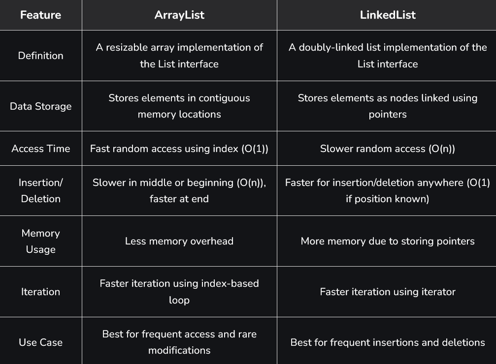
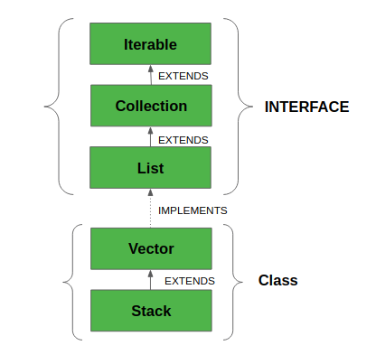
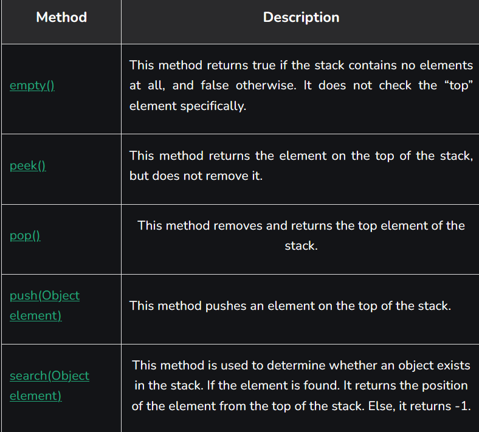
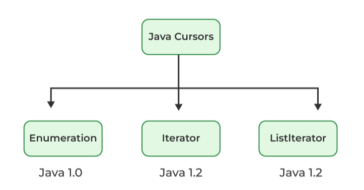
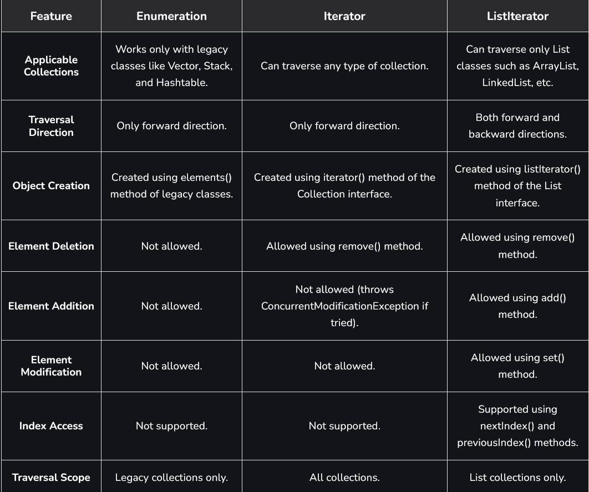

# Part - 5 - Difference between ArrayList vs LinkedList

ArrayList and LinkedList are two commonly used classes in Java that implement the List interface. Both maintain insertion order and allow duplicate elements, but they differ in memory structure, data access, and performance for insertion and deletion operations.
- ArrayList is based on dynamic array, while LinkedList uses a doubly linked list.
- ArrayList provides faster random access, whereas LinkedList is efficient for frequent insertions and deletions.
- Both are part of the Java Collections Framework and support generic data storage.

**ArrayList** : 
ArrayList is a class in JCF that stores elements in a sequential manner and automatically grows in size when needed. It is widely used for fast data retrieval and managing ordered collections of elements.
- Allows storing elements of the same or different data types using generics.
- Supports index-based operations like searching, updating, and accessing elements.
- Maintains insertion order of elements during storage and retrieval.

**Syntax** :
```
ArrayList<DataType> listName = new ArrayList<>();
```

```
public class Test{
    public static void main(String[] args){
        ArrayList<String> list = new ArrayList<>();

        list.add("Java");
        list.add("Python");
        list.add("C++");

        Sop(list);
    }
}

Output
[Java, Python, C++]
```

**LinkedList** : 
LinkedList is a class in JCF that stores elements as interconnected nodes instead of continuous memory structure. It is mainly used when frequent insertion and deletion operations are required.
- Implements both List and Deque interfaces in Java.
- Allows efficient insertion and deletion of elements from both ends.
- Maintains insertion order and supports duplicate elements.

**Syntax** :
```
LinkedList<DataType> listName = new LinkedList<>();
```
```
public class Test{
    public static void main(String[] args){
        LinkedList<String> list = new LinkedList<>();

        list.add("Java");
        list.add("Python");
        list.add("C++");

        Sop(list);
    }
}

Output
[Java, Python, C++]
```

**ArrayList vs LinkedList** :



**Stack** :
A Stack is a liner data structure that follows the Last In First Out (LIFO) principle and is defined in the java.util package. Internally, it extends the Vector class.
- Stack class maintains insertion order and allows duplicates and null values.
- Grows dynamically when its capacity is exceeded.
- Stack methods are synchronized.
- Stack class implements List, RandomAccess, Cloneable, and Serializable interfaces.

```
public class Test{
    public static void main(String[] args){
        Stack<Integer> s = new Stack<>();

        // Push elements onto stack
        s.push(1);
        s.push(2);
        s.push(3);
        s.push(4);

        // Pop elements from stack
        while(!s.isEmpty()){
            Sop(s.pop());
        }
    }
}
Output
4
3
2
1
```

**Hierarchy of Stack class** :
Stack class extends Vector, which extends Object.



**Operations on Stack** :

1. **Adding Elements** :
   With the help of push() method we can add element to the stack. The push() method place the element at the top of the stack.
   ```
   class Test{
    public static void main(String[] args){
        Stack stack1 = new Stack();

        Stack<String> stack2 = new Stack<String>();

        stack1.push("4");

        stack2.push("Geeks");

        Sop(stack1);
        Sop(stack2);
    }
   }
   Output
   [4]
   [Geeks]
   ```

2. **Accessing the Element** :
   With the help of peek() method we fetch the top element of the stack.
   ``` 
   public class Test{
    public static void main(String args[]){
        Stack<String> stack = new Stack<String>();

        stack.push("Welcome");
        stack.push("Back");

        Sop("Initial Stack" + stack);

        Sop("The element at the top :" + stack.peek());

        Sop("Final Stack " + stack);
    }
   }
    Output

    Initial Stack: [Welcome, Back]
    The element at the top : Back
    Final Stack [Welcome, Back]
    ```

3. **Removing Elements** :
   With the help of pop() method we can delete and return the top element from the stack.
   ```
   public class Test{
    public static void main(String args[]){
        Stack<Integer> stack = new Stack<Integer>();

        stack.push(10);
        stack.push(20);
        stack.push(30);

        Sop("Initial Stack " + stack);

        Sop("Popped Element"  + stack.pop());

        Sop("Stack after pop" + stack);
    }
   }
   Output

    Initial Stack: [10,20,30]
    Popped element: 30
    ```

**Methods in Stack Class** :



**Cursor** : 

A Java Cursor is an object that is used to iterate, traverse, or retrieve a Collection or Stream object's elements one by one.
- Cursor allow sequential access to each element in collection.
- Some cursors allow addition, removal, or replacement of elements.
- Cursors are generic, ensuring type safety and void ClassCastException.

**Types of Cursor** :



1. **Enumeration Cursor** :
   The Enumeration cursor is a legacy cursor, introduced before java 2 (JDK 1.2). It is used mainly with older classes like Vector and Hashtable.

   **Declaration**
   ```
   public interface Enumeration<E>
   ```

   **Import Methods of Enumeration** :
   - **boolean hasMoreElements()** : Returns true if more elements are available.
   - **E nextElement()** : Returns the next element of the collection.
   ```
   public class Test{
    public static void main(String args[]){
        Vector<Integer> v = new Vector<>();
        v.add(10);
        v.add(20);
        v.add(30);

        Enumeration<Integer> e = v.elements();

        Sop("Elements using enumerations : ");
        while(e.hasMoreElements()){
            Sop(e.nextElement());
        }
    }
   }

   Output
   Elements using enumeration
   10
   20
   30
   ```

2. **Iterator Cursor** :
   The iterator cursor is the universal cursor introduced in JDK 1.2. It can be used with all classes of the JCF suc as ArrayList, HashSet, LinkedList.

   **Declaration** :
   ```
   public interface Iterator<E
   ```

   **Import Methods** :
   - **boolean hasNext()** : Returns true if more elements exist
   - **E next()** : Returns the next element.
   - **void remove()** : Removes the current element.
   ```
   public class Test{
    public static void main(String args[]){
        Collection<String> names = new ArrayList<>();
        names.add("Alice");
        names.add("Bob");

        Iterator<String> itr = names.iterator();

        Sop("ELements using iterator");
        while(itr.hasNext()){
            String name = itr.next();
            Sop(name);
        }
    }

   }
   Output
   Elements using iterator
   Alice
   Bob
   ```

   **Note** : Using iterator traverse only in forward direction and cannot modify or add elements.

3. **ListIterator Cursor** :
   The ListIterator cursor is bidirectional cursor, introduced in JDK 1.2. It is used only with List implementations such as ArrayList and LinkedList.

   **Declaration** : 
   ```
   public interface ListIterator<E> extends Iterator<E>
   ```

   **Important Methods** :
    - **boolean hasNext()** : Check if next elements exists.
    - **E next()** : Returns the next element.
    - **boolean hasPrevious()** : Checks if previous elements exists.
    - **E previous()** : Returns the previous element.
    - **void remove()** : Removes current element.
    
    ```
    public class Test{
        public static void main(String[] args){
            List<String> list = new ArrayList<>();
            list.add("Java");
            list.add("Python");

            ListIterator<String> li = list.listIterator();

            Sop("Forward traversal");
            while(li.hasNet()){
                Sop(li.next());
            }

            Sop("Backward Traversal");
            while(li.hasPrevious()){
                Sop(li.previous);
            }
        }
    }

    Output
    
    Forward Traversal:
    Java
    Python
    C++
    Backward Traversal:
    C++
    Python
    Java
    ```

**Difference Between Enumeration, Iterator, and ListIterator** : 

