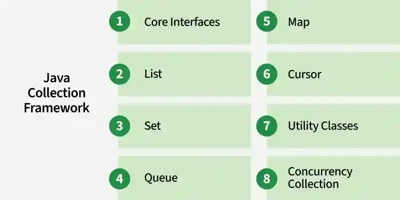

# Part - 1 - Java Collections

Java Collection Framework (JCF) is a set of classes and interfaces that provide ready-made data structures to store and manipulate groups of objects efficiently.
- Java provides collection interfaces like List, Set, Map and Queue, with ready-made classes such as ArrayList, HashSet, HashMap PriorityQueue, so you don't have to write data-handling code from scratch.
- The collection framework improves productivity by making code more reusable, maintainable and faster to develop.

Features of Java Collection 
- Provides ready-to-use data structures ( ArrayList, HashSet, HashMap)
- Offers interfaces (Collection, List, Set, Map, Queue) to define standard behaviors.
- Supports dynamic resizing, unlike arrays with a fixed size. 
- Includes algorithms(sorting, searching, iteration) via the Collections utility class.
- Improves code reusability and performance by reducing boilerplate code.



---

Example

Java program to illustrate the use of ArrayList (dynamic array).

```
public class Test{
    public static void main(String[] args){
        List<String> list = new ArrayList<>();

        list.add("Java");
        list.add("Python");
        list.add("C++");

        Sop("Programming languages");

        for(String lang : list){
            Sop(lang);
        }
    }
}

Output

Programming Languages:
Java
Python
C++
```

**Core Interfaces** : 

The foundation of the Collections Framework is built on interfaces like Collection, List, Set, Queue, Deque and Map. They define the behavior of different collections types and serve as a blueprint for implementations.
