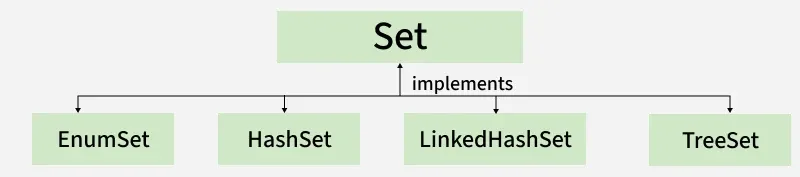
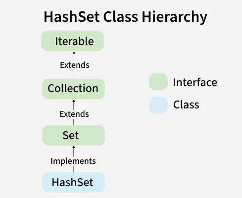

# Part - 7 - Set Interface.

Set interface is a part of JCF, located in java.util.package. It represents a collection of unique elements, meaning it odes not allow duplicate values.
- The set interface does not allow duplicate elements.
- It can contain at most one null value except TreeSet impl which does not allow null.
- The set interface provides efficient search, insertion, and deletion operations.

**Declaration** : 
```
public interface Set<E> extends Collection <E>
```
```
public class Test{
    public static void main(String args[]){
        Set<String> s = new HashSet<>();
    }
}
```

**Hierarchy of Set interface** :



**Classes that implement Set** : 
- **HasSet** : A set that stores unique elements without any specific order, using a hash table and allows one null element
- **EnumSet** : A high performance set designed specifically for enums types, where all elements must belong to the same enum.
- **LinkedHashSet** : A set that maintains the order of insertion while storing unique elements.
- **TreeSet** : A set that stores unique elements in sorted order, either by natural ordering or a specified comparator.

**Creating Set Objects** :
Since Set is an interface, objects cannot be created of the typeset. We always need a class that implements this interface in order to create an object. And also, after the introduction of Generics in Java 1.5, it is possible to restrict the type of object that can be stored in the Set. 
```
Set<Obj> set = new HashSet<Obj> ();
```

**Performing Operations** : 

1. **Adding Elements** : 
   To add elements to a set, we use add() method
   ```
   class Test{
    public static void main(String [] args){
        Set<String> s = new HashSet<String>();
        s.add("B");
        s.add("B");
        s.add("C");
        s.add("A");

        Sop(s);
    }
   }
   ```

2. **Accessing Elements** :
   If we need to access the elements we use inbuilt methods like contains().
   ```
   class Test{
    public static void main(String args[]){
        Set<String> h = new HashSet<String>();

        h.add("A");
        h.add("B");
        h.add("C");
        h.add("E");

        String s = "D";

        Sop("Contains" + s + " " + h.contains(s));
    }
   }
   ```

3. **Removing Elements** :
   The values can be removed using remove() method.
   ```
   class Test{
    p s v m(String args[]){
        Set<String> h = new HashSet<String>();

        h.add("A");
        h.add("B");
        h.add("C");
        h.add("D");

        h.remove("D");
    }
   }
   ```

4. **Iterating Elements** :
   There are various way to iterate, the most famous one is to use enhanced loop.
   ```
   class Test{
    p s v m(String args[]){
        Set<String> h = new HashSet<String>();

        h.add("A");
        h.add("B");
        h.add("C");

        for(String value : h){
            Sop(value + ", " );
        }
    }
   }
   ```


**HashSet** : It implements the Set interface of the Collections Framework. It is used to store the unique elements, and it doesn't maintain any specific order of elements.
- HashSet does not allow duplicate elements.
- Uses HashMap internally which is an implementation of hash table data structure.
- Also implements Serializable and Cloneable interfaces.
- HashSet is not thread-safe. To make it thread-safe, synchronization is needed externally.
- Does not support primitive types , wrapper classes are required.

```
class Test{
    p s v m(String args[]){
        HashSet<Integer> hs = new HashSet<>();

        hs.add(1);
        hs.add(2);
        hs.add(3);

        Sop("HashSet Size: " + hs.size());
        Sop("Elements in HashSet: " + hs);
    }
}
```

**Hierarchy Diagram of HashSet** :



**Capacity of HashSet** :
Capacity refers to the numbers of buckets in the hash table. The default capacity of a HashSet is 16 and the load factor is 0.75.

When the number of elements exceeds the threshold, the capacity automatically increases
```
new capacity = old capacity * 2
```

**Collision in HashSet** : 

HashSet internally uses a hash table (via HashMap) where elements are stored based on their hash codes. Sometimes, different elements may produce the same hash code leading to a collision.

**Note** : HashSet handles collisions using chaining(LinkedList) and converts it into a balanced tree (Red-Black Tree) when the number of elements in a bucket exceeds a threshold (Java 8+).

**Load Factor** : Load factor is a measure that controls how full the HashSet can get before resizing. Default Load Factor = 0.75. If the number of elements exceeds the threshold, the capacity is double.

```
Threshold = capacity x load factor
```

**Constructors of HashSet** :

1. **HashSet()** :
    Creates a new empty HashSet with default capacity(16) and load factor (0.75)
    ```
    HashSet<String> set = new HashSet<>();
    ```

2. **HashSet(int initialCapacity)** :
   Creates an empty HashSet with the specified initial capacity and default load factor (0.75)
   ```
   HashSet<Type> set = new HashSet<>(initialCapacity);
   ```

3. **HashSet(int initialCapacity, float loadFactor)** :
   Creates an empty HashSet with the given initial capacity and load factor.
   ```
   HashSet<Type> set = new HashSet<> (initialCapacity, loadFactor);
   ```

4. **HashSet(Collection<? extends E>)** :
   Creates a new HashSet containing the elements of the specified collection (removes duplicates automatically)
   ```
   HashSet<Type> set = new HashSet<>();
   ```

**Performing Operations** : 

1. **Adding Elements in HashSet** :
    To add an element, we can use the add() method. however the insertion order is not retained in the HashSet. We need to keep a note that duplicate elements are not allowed and all duplicate elements are ignored.
    ```
    class Test{
        p s v m(String args[]){
            HashSet<String> hs = new HashSet<>();

            hs.add("One");
            hs.add("Twp");
            hs.add("Three");
        }
    }
    ```

2. **Removing Elements** : 
   The values can be removed from the HashSet using the remove() method.
   ```
   class Test{
    p s v m(String args[]){
        HashSet<String> hs = new HashSet<>();

        hs.add("One");
        hs.add("Two");
        hs.add("Three");

        hs.remove("Three");
    }
   }
   ```

3. **Iterating** :
   Iterate through the elements of HashSet using the iterator() method. Also, the most famous one is to use the enhanced for loop.
   ```
   class Test{
    p s v m{
        HashSet<String> hs = new HashSet<>();

        hs.add("A");
        hs.add("B");
        hs.add("C");
        hs.add("D");

        Iterator<String> iterator = hs.iterator();

        while(iterator.hasNext()){
            Sop(iterator.next()+ " " );
        }

        for(String element : hs){
            Sop(element + " , ");
        }
    }
   }
   ```

**Methods of HashSet** :


**Differences between HashSet and HashMap.** :


**LinkedHashSet** : 

LinkedHashSet is a class in java that implements the Set interface and maintains insertion order while storing unique elements. It combines the features of a HashSet and a LinkedList.
- Maintains insertion order of elements.
- Stores unique elements only (no duplicate)
- Provides fast performance for basic operations.

```
class Test{
    p s v m(String args[]){

        LinkedHashSet<String> set = new LinkedHashSet<>();
        set.add("Apple");
        set.add("Mango");
        set.add("Banana");
    }
}
```
**Note** : If an element is removed and then added again. It is inserted at the end of the LinkedHashSet, because insertion order is maintained based on the latest insertion.

**Hierarchy of LinkedHashSet** : 
It implements the Set interface, which is a sub-interface of the Collection interface.


**Constructors of LinkedHashSet** : 
1. **LinkedHashSet()** : 
   The constructor is used to create an empty LinkedHashSet with the default capacity - 16 and load factor 0.75.
   ```
   LinkedHashSet<E> hs = new LinkedHashSet<E>();
   ```
2. **LinkedHashSet(Collection C)** : Used in Initializing the LinkedHashSet with the elements of the collection C.
    ```
    LinkedHashSet<E> hs = new LinkedHashSet<E>(Collection<? extends E> c);
    ```
3. **LinkedHashSet(int initialCapacity)** : 
   Used to initialize the size of the LinkedHashSet with the integer mentioned in the parameter
   ```
   LinkedHashSet<E> hs = new LinkedHashSet<E> (int initialCapacity);
   ```
4. **LinkedHashSet(int capacity, float fillRation)** :
   Creates an empty LinkedHashSet with specified capacity and load factor.
   ```
   LinkedHashSet<E> hs = new LinkedHashSet<E>(capacity, loadFactor);
   ```

**Operations** :

1. **Adding elements** : 
   To add an element we can use the add() method. This is different from HashSet because in HashSet, the insertion order is not retained but is retained in LinkedHashSet.
   ```
   class Test{
    p s v m(String args[]){
        LinkedHashSet<String> lh = new LinkedHashSet<String>();

        lh.add("A");
        lh.add("B");
        lh.add("C");
    }
   }
   ```

2. **Removing Elements** : 
   Values can be removed using remove() method.
   ```
   class Test{
    p s v m(String args[]){
        LinkedHashSet<String> lh = new LinkedHashSet<String>();

        lh.add("A");
        lh.add("B");
        lh.add("C");

        lh.remove("C");
    }
   }
   ```

3. **Iterating** : 
   Iterate through elements using iterator() method.
   ```
   class Test{
    p s v m(String args[]){
        Set<String> lh = new LinkedHashSet<String>();

        lh.add("A");
        lh.add("B");
        lh.add("C");
        lh.add("D");

        Iterator itr = new Iterator();

        for(String s : lh){
            Sop(s + " ");
        }
    }
   }