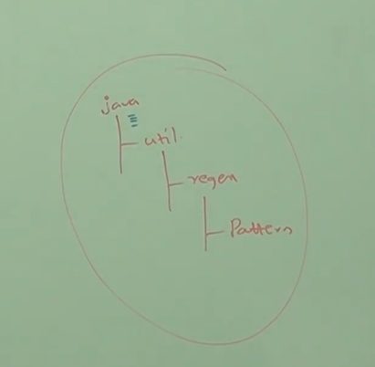

# Part - 2,3 - Imports and different types.

**Types of import statements** :

1. Explicit Class Import
2. Implicit Class Import
<br>

**Explicit Class Import** :

1. A statement that imports a single, specific class from a package by providing its full name and path.
```
eg - import java.util.ArrayList;
```
2. It is highly recommended because it improves readability of the code.

**Implicit Class Import** :

1. It imports an entire package of classes at once using wildcard asterisk (*).
2. It is also known as Wildcard import.
```
eg - import java.util.*
```
1. It is not recommended as reduced readability.

**Note** :

1. Whenever we are using fully qualified name we are not required to write import statement and vice-versa.
2. While resolving class name compiler will always give the precedence in following order.
```
    a. Explicit class import.
    b. Classes present in current working directory (CWD) (default package).
    c. Implicit class import.
```
3. Whenever we are importing a java classes all classes and interfaces present in the package while default available but not subpackage classes, if we want to use sub package class then we should write import until sub package level.



To use pattern class in our program the import statement required is import java.util.regex.*;

4. All classes and interfaces present in the following packages are by default available to every java program hence we are not required to write import statement.
```
    a. java.lang
    b. default package(CWD)
```
5. Import statements are totally compile related concept if more number of imports then more will be the compile time but theres no effect on  execution time (Runtime).

**Diff b/w C lang #include and java lang import statement** :
1. in the case of C lang #include all input output header files will be loaded at the beginning only (at translation time) hence it is static include.
2. But in the case of java import statements no .class file will be loaded at the beginning, whenever we are using a particular class then only corresponding .class file will be loaded this is like dynamic include or load on demand or load fly

**Static imports** :
1. Introduced in 1.5v.
2. According SUN enterprise usage of static import reduces length of the code and improves readability but according to world wide programming experts usage of static import creates confusion and reduces readability hence if theres no specific requirement then its not recommended to use static import.
3. Usually we can access static members by using class name, but whenever we are writing static import we can static members directly without class name.

**Explanation about System.out.println()**
```
class test{
    Static PrintStream out;
    .
    .
    .
    .
}

System.out.println()

Here System is a class present in java.lang.package.
Out is a static variable in System class of the type PrintStream.
println() is a method present in PrintSteam class.

```
4. While resolving static members compiler will always consider the priority in following order.
```
    a. Current Class static members.
    b. Explicit static imports.
    c. Implicit static imports.

eg - 
    import static java.lang.Integer.MAX_VALUE;
    import static java.lang.Byte.*;

    public class Test{
        static int MAX_VALUE = 999;

        public static void main(String[] args){
            Sop(MAX_VALUe);
        }
    }

OUTPUT -> 999
```

5. Two packages contains a class or interfaces with same name is very rare and hance ambiguity problem in normal imports, but two classes and interfaces contains a variable or method with a same name is very common and hence ambiguity is also very common problem in static import.
6. Usage of static import reduces readability and creates confusion and hence if theres no specific requirement then it is not recommended to use static import.

