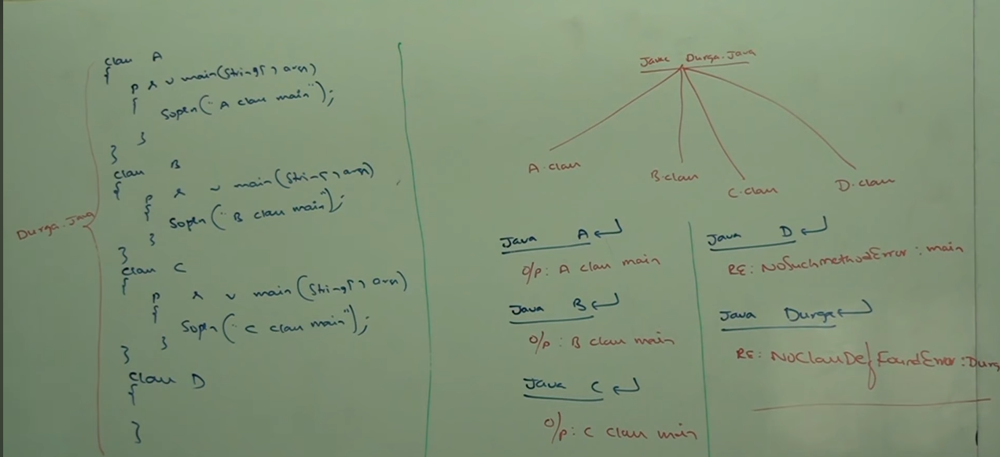

# Part 1 - Java Source File Structure.

**Java Source file structure** :

A java program can contain any number of classes but at most one top-level public class is allowed per source file, if there iss a public class then name of the program and name of the public class must be the same otherwise we will get compile time error :

```
eg  -
    class A{

    }
    class B{

    }
    class C{

    }
```
**Case - 1** : If there is no public class then we can use any name and there are no restrictions. (eg- A.java, B.java, C.java). <Br>
**Case - 2** : If any one class from among other classes is public then we should use that class name as file name. Otherwise we will get compile time error saying class B is public, should be declared in a file name B.java.

```
eg -
    class A{

    }
    public class B{

    }
    class C{

    }

    Here the file name should be B.java.
```

**Case - 3** : If there are multiple public classes then we will get an error saying class N is public, should be declared in a file name N.java.

**Case - 4**: If there are multiple classes and their main method which class should be the name of the file and how execution will be happen  **(see image)**


**Conclusions** :

1. whenever we are compiling a java program for every class present in that program a separate .class will be generated
2. We compile ```.java``` source files and JVM executes ```.class``` files.
3. Whenever we are executing a java class the corresponding class main method will be executed, if the class doesn't contain main method then we will get runtime exception -> Main method not found in class Name.
4. If the corresponding .class file is not available then we will get runtime exception -> NoClassDefFoundError : file name.
5. It is not recommended to declare multiple classes in a single source file, It is highly recommended only one class per source file and name of the program should be same as class name the main adv of this approach is readability and maintainability of the code will be improved.

**Java source file structure** :
```
package statements

import statements

class/interfaces declarations
```
package -> it should be the first statement.

import -> should come after package.

class definitions -> are supposed to come after imports.

**Missing public class** :

If no public class exists, then the file name can be anything but while executing class name must be used
```
class Test{
    public static void main(String[] args){
        Sop("Hello");
    }
}

file name => abc.java

Compile time -> javac abc.java

Runtime -> java Test
```