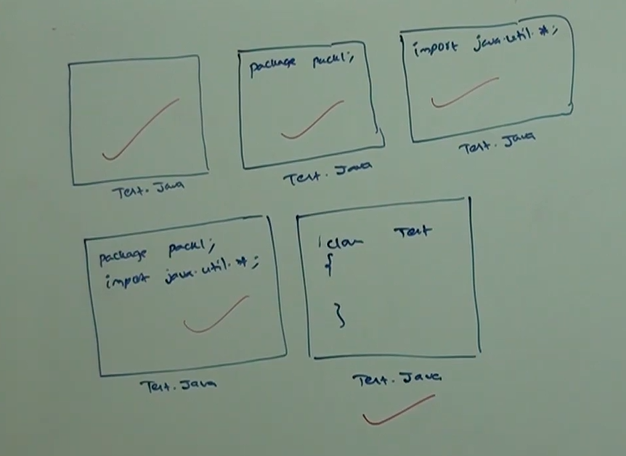

# Part 4 - Packages

**Packages** :

1. It is an encapsulation mechanism to group related classes and interfaces into a single unit called package.

```
eg 1 - All classes and interfaces which are required database operations are grouped into a single package which is nothing but java.sql package.

eg 2 - All classes and interfaces which are useful for file input output (io) operations are grouped into a separate package which is -> java.io package.

```
2. The main advantage of packages are :

```
    a. To resolve naming conflicts(unique identification of components).
    b. It improves modularity of the application.
    c. It improves maintainability of the application.
    d. It provides security for our components.
    e. Packages provide namespace management.
```
3. There's one universally accepted naming convention for packages that is to use internet domain name in reverse, and packages name are usually written in lowercase characters.

```
eg - com.icicibank.loan.housing.Account

com.icicibank -> client internet domain name in reverse.
loan -> module name.
housing -> sub module name.
Account -> class name.
```

**Conclusion** :

1. In any java source file there can be at most one package statement i.e more than one package statement is not allowed otherwise we will get compile time error.

```
package pack1;
package pack2; -> Error - class, interface or enum expected

public class A {

}
```

2. In any java program the first non-comment statement should be package statement (if its available) otherwise we will get compile time error.

```

import java.util.*;
package pack1; -> Compile time Error - class, interface or enum expected

public class A{

}
```

3. The following is valid java source file structure:

```
eg -
    package Statement; -> At most one.
    import Statements; -> Any number.

    class/interface/enums -> Any number.
```

**Note** :

1. An empty source file is valid java program hence the following are valid java source files:



2. If there is no package statement then the classes belong to the default package.
3. Package structure and directory structure must match.

```
package com.durga.test;

com/durga/test/
```