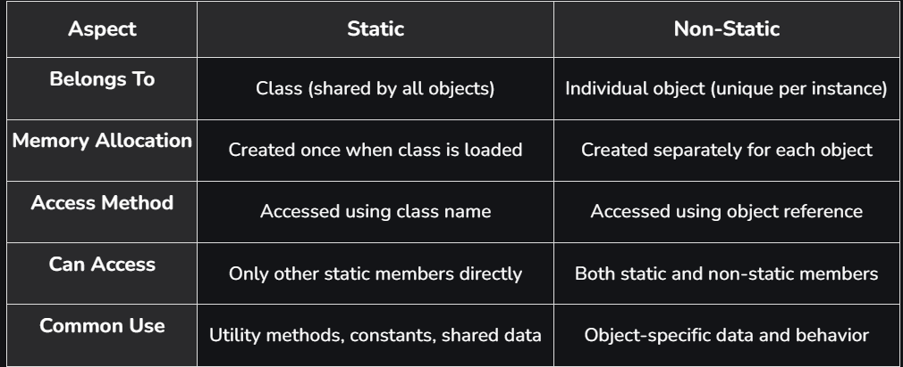

# Part - 9 - Static Modifiers.

**Static Modifiers** :

1. Static is a modifier applicable for variables, methods, blocks, inner classes (static nested class), but not for top-level classes.
2. We cant declare top level classes with static modifiers but we can declare inner class as static(Static nested classes).
3. In the case of instance variables for every object a separate copy will be created but for static variables a single copy will be created at class level and shared by every object of that class.
4. We cant access instance members directly from static area but we can access from instance area directly.
5. We can access static members from both instance and static area directly.
6. Overloading concept is applicable for static method including main method but JVM will always call String[] args main method only.

```
class Test{
    public static void main(String[] args){
        Sop("String");
    }
    public static void main(int[] args){
        Sop("int[]");
    }
}
O/P -> String
```
7. Inheritance concept is applicable for static method including main method hence while executing child class if child class doesn't contain main method then parent class main method will be executed.

```
class P{
    public static void main(String[] args){
        Sop("Parent main");
    }
}

class C extends P{

}

O/P -> Parent Main
```

8. Inside method implementation if we are using at least one instance variable then that method talks about a particular object hence we should declare method as instance method.
9. Inside method implementation if we are not using any instance variable then this method is nowhere related to a particular object hence we have to declare such type of method as static method irrespective of whether we are using static variables or not.
10. Static methods are not overridden, static method participate in method hiding not overriding.

```
class P{
    
    public static void m1(){
        
        Sop("Parent");
    }
}

class C extends P{

    public static void m1(){
    
        Sop("Child");
    }
}
```
**Static VS Non Static** :




**Synchronized modifiers** :

1. Synchronized modifiers is only applicable for method and block but not for classes and variables
2. If multiple thread are trying to operate on a single java object then there may a chance of data inconsistency problem this is called race condition.
3. We can overcome this problem by using Synchronized keyword.
4. If a method or block is declared as Synchronized then at a time only one thread is allowed to execute that method or block and given object so that data inconsistency problem will be resolved.
5. Disadvantage of synchronized keyword is that it increases waiting time of threads and creates performance problem. If theres no specific requirement then its not recommended synchronized keyword.
6. Synchronized method should compulsory contain implementation.
7. It provides thread safety by allowing only one thread at a time to execute the synchronized code for a particular object.
8. **Race condition** occurs when multiple threads modify shared data simultaneously and the final result depends on the order of execution.