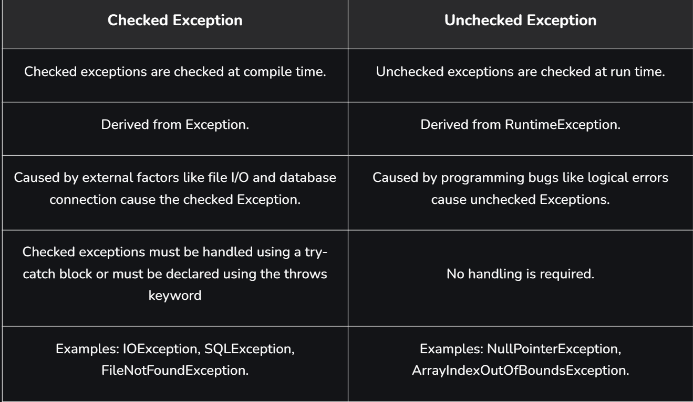

# Part - 3 - Checked and Unchecked Exceptions

**Checked Exceptions** :
1. These exceptions are checked at compile time, forcing the programmer to handle them explicitly.
2. If a method throws a checked exception then the exception must be handled using a try-catch block and declared the exception in the method signature using the throws keyword.

**Types of Checked Exception** :
1. Fully Checked Exception : A checked exception where all its child classes are also checked (eg - IOException, InterruptedException).
2. Partially Checked Exception : A checked exception where some of its child classes are unchecked (eg - Exception).

Checked exceptions represent invalid conditions in areas outside the immediate control of the program like memory, network, file system. Any checked exception is subclass of ```Exception```.

**Unchecked Exception** :
1. Are the exceptions that are not checked at compile time.
2. In java exceptions under Error and RuntimeException classes are unchecked exceptions, everything else under throwable is checked.
```
class Test{
    public static void main(String[] args){
        int x = 0;
        int y = 10;
        int ans = y/x;
    }
}

Reason -> It compiles fine, but it throws an ArithmeticException when run. The compiler allows it to compile because ArithmeticException is an unchecked exception.
```
**Note** :

1. Unchecked exceptions are runtime exceptions that are not required to be caught or declared in throws clause.
2. These exceptions are caused by programming errors, such as attempting to access an index out of bounds array.
3. Unchecked exceptions include all subclasses of the RuntimeException class, as well as the Error class and its subclass,

**Difference B/W Checked and Unchecked Exceptions** :

