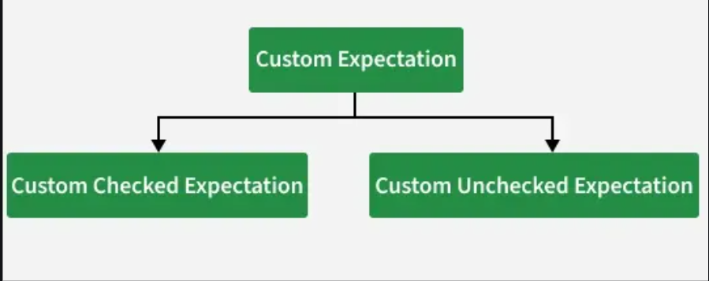
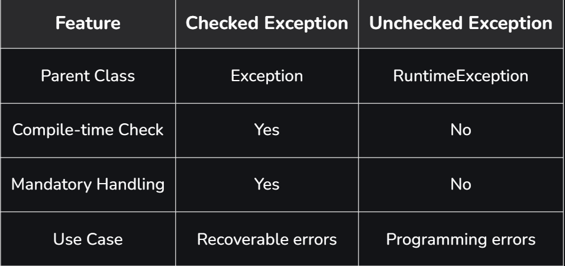

# Part - 3-B - User-Defined Custom Exception

**User-Defined Exception** :

A user-defined custom exception is an exception created by programmer to represent application-specific or business-specific error scenarios.

**Examples**:
1. Invalid bank transaction.
2. Insufficient balance.
3. Age not eligible.

**Problem without Custom Exceptions** :
```
public class Test{
    public static void main(String args[]){
        int age = 18;

        if(age < 20){
            Sop("Error");
        }
    }
}

O/P -> Error
```
**Issues with above approach is** :
1. The error message is unclear.
2. No meaningful exception is thrown.
3. Difficult to debug in large applications.
4. Business logic and error handling are mixed.

**Solution : Using a User-Defined Custom exceptions**

Instead of printing vague messages, we can throw a meaningful custom exception.

1. This clearly explains the problem.
2. Improves Debugging.
3. Separates business logic from error handling.

```
throw new InvalidAgeException("Age must be above 20");
```

**Custom Exception** :
1. An exception defined by the user to handle specific application requirements.
2. These exceptions extend either the Exception class (for checked exceptions) or the RuntimeException class(for unchecked exceptions).

**Why java use Custom Exceptions** :
1. To represent application-specific errors.
2. To add clear, descriptive error messages for better debugging.
3. To encapsulate business logic errors in a meaningful way.

**Types of Custom Exception** :




**Checked Exception** : It extends the Exception class, and it must be declared in the throws clause of the method signature.

**Unchecked Exception** : It extend RuntimeException and are not checked by the compiler, so they don't need to be declared or handled. They usually represent programming error or invalid operations.

**How to create a User-Defined Custom Exception** :
1. Create a class extending Exception or RuntimeException.
2. Provide constructors with custom message.

```
class InvalidAgeException extends Exception{
    
    public InvalidAgeException(String m){
        super(m);
    }
}

```

**Difference B/W Checked and Unchecked** :

