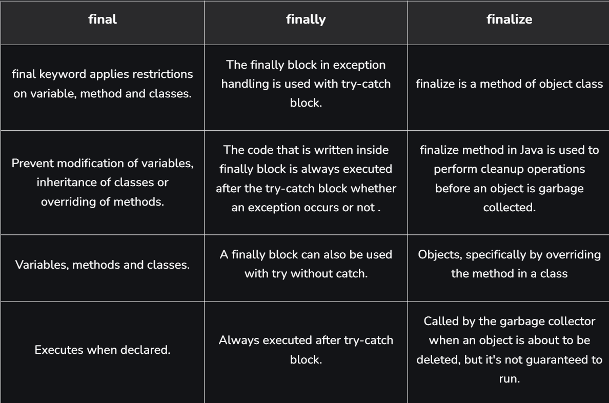

# Part - 4 - Finally Block

In java final,finally and finalize() are three different concepts that serve different purpose.The final keyword is used to restrict changes, finally is used in exception handling, and finalize() is related to garbage collection
1. final -> prevents modification of variables, methods and classes.
2. finally -> always executes after the try-catch block.
3. finalize() -> runs before an object is garbage collected (deprecated java 9+).

**final Keyword** :

The final keyword is used to restrict changes in java. It can be applied to variables, methods and classes. Once declared final, certain modifications are not allowed.

1. A final variable cannot be reassigned after initialization.
2. A final method cannot be overridden by subclasses.
3. A final class cannot be inherited.

```
Syntax

final int b = 100;
```

```
Example

class Test{
    public static void main(String[] args){
        int a = 5;

        final int b = 6;

        a++;

        b++;
    }
}

O/P -> cannot assign a value to final variable b
```

**Note** : If we declare any variable as final we cant modify its value. Attempting to do so results in a compile time error.

**finally Keyword** :

The finally block is used in exception handling. It contains code that is executed after try-catch blocks, regardless of whether an execution occurs or not.

1. Always executes after try-catch block.
2. Used for cleanup tasks such as closing files or database connections.
3. Executes even if an exception is thrown.

```
Syntax

try{
    //Code that might throw an exception
}catch(ExceptionType e){
    //Code to handle exception
}finally{
    //Code that will always execute.
}
```

```
Example

public class Test{
    public static void main(String args[]){
        try{
            Sop("Try block");
            int res = 10/0;
        }catch(ArithmeticException e){
            Sop("Exception" + e.getMessage());
        }finally{
            Sop("finally block always execute");
        }
    }
}
```

**finalize() Method** :

The finalize() method is defined in the Object class and is called by the Garbage Collector before an object is removed from the memory. It was traditionally used for cleanup operations.
1. Invoked before an object is garbage collected.
2. Defined in the Object class.
3. Used for resource cleanup before object destruction.

```
Syntax

protected void finalize() throws Throwable{}
```
```
Example

public class Test{
    public static void main(String args[]){
        Test t = new Test();

        //Making the object eligible for garbage collection
        t = null;

         try {
            Thread.sleep(1000);
        }
        catch (InterruptedException e) {
            e.printStackTrace();
        }

        Sop("End of the garbage collection");
    }

    // Defining the finalize method
    @Override protected void finalize()
    {
        Sop("Called the finalize() method");
    }
}
```

**Difference B/W final, finally, finalize** :


