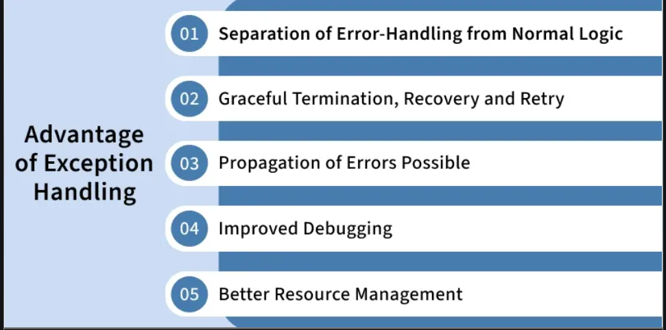
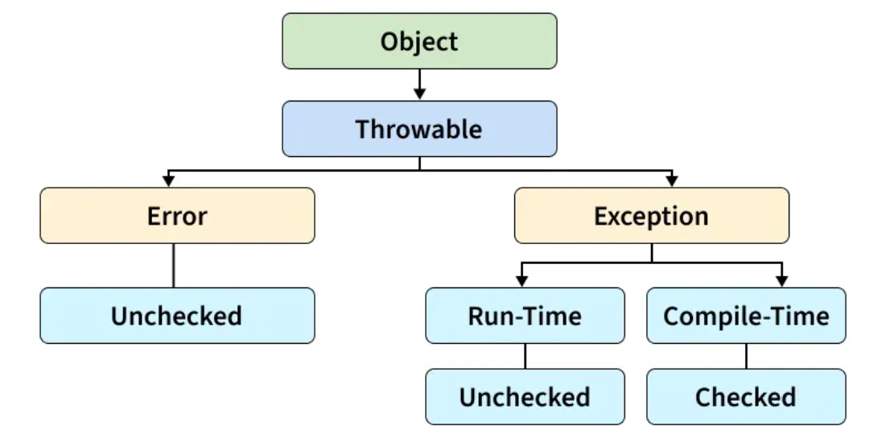
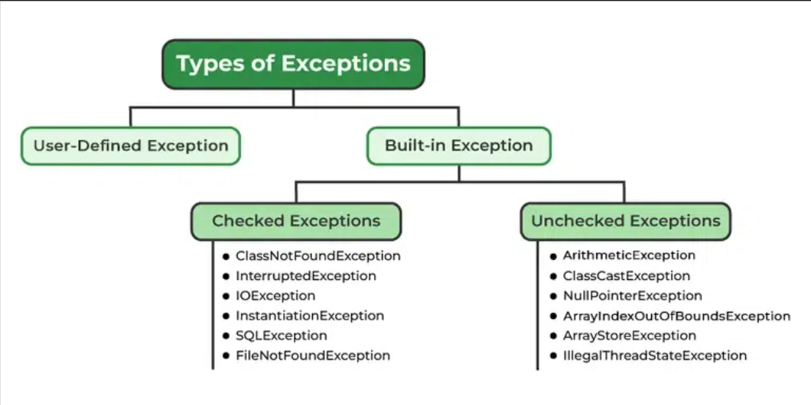
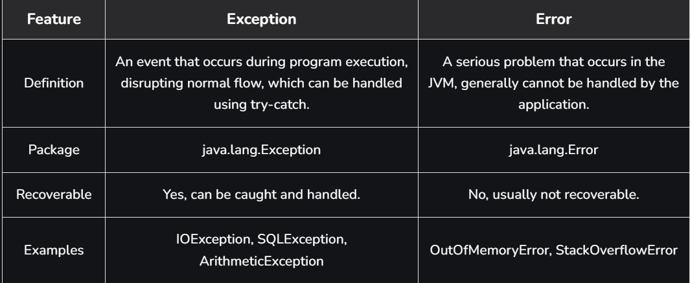

# Part - 1, 2 - Exception Handling

**Exception Handling** :

1. It is a mechanism used to handle both compile-time (checked) and runtime (unchecked) exceptions, allowing a program to continue execution smoothly even in the presence of errors.
2. Handles abnormal conditions that occur during program execution.
3. Helps maintain program stability by preventing unexpected termination.

```
class Test{
    
    public static void main(String[] args){
        int m = 10;
        int n = 10;

        try{
            int ans = m / n;
            Sop("Answer is :");
        }catch(ArithmeticException e){
            Sop("Error division by Zero");
        }
    }
}

O/P -> Error division by Zero.
```

**Advantages of Exception Handling** :



**Finally Block** :

1. The finally block executes after the try and catch blocks in most situations, whether an exception arose or not.
2. It is typically used for closing resources such as database connections, open files, or network connections.

**Finally may not execute in cases like** :

1. System.exit()
2. JVM crash
3. infinite loop before finally

```
class FinallyBlock{
    public static void main(String[] args){
        
        int[] numbers = {1, 2, 3, 4}
   
        try{
        
            Sop(numbers[5])
        }catch(ArrayIndexOutOfBoundsException e){
        
            Sop("Exception here" + e);
        }finally{
        
            Sop("This block always executes");
        }

        Sop("Program continues");
    }
}
```

**throw and throws keyword** :
1. **throw** : Used to explicitly throw a single exception. We use throw when something goes wrong and we want to stop normal flow and hand control to exception handling.

```
class Test{
    static void checkAge(int age){
        if(age < 10>){
            throw new IllegalArgumentException("Age must be 10 or above");
        }
    }

    public static void main(String[] args){
        checkAge(15);
    }
}

O/P -> Exception in thread "main" java.lang.IllegalArgumentException: Age must be 18 or above
```

2. **throws** : Declares exceptions that a method might throw, informing the caller to handle them. It is mainly used with checked exceptions. If a method calls another method that throws a checked exception and it doesnt catch it it must declare that exception in its throws class.
```
class Test{
    //Method declares that it may throw IOException
    static void readFile(String fileName) throws IOException{

    }
}
```

**Internal Working of try-catch block** :

1. JVM executes code inside the ```try``` block.
2. If an exception occurs, remaining ```try``` code is skipped and JVM searches for a matching ```catch``` block.
3. If found, the ```catch``` block executes.
4. Control then moves to the finally block (if present).
5. If no matching catch is found, the exception is handled by JVM's default handler.
6. The ```finally``` block always executes, whether an exception occurs or not.

**Note** : When an exception occurs and is not handled, the program terminates abruptly and the code after it, will never executes.

**Java Exception Hierarchy** :

All exceptions and errors are subclasses of the ```Throwable Class```. It has two main branches
1. Exception
2. Error



**Types of Java Exceptions** :


<br>

**Built-in Exceptions** :

Built in Exceptions are pre-defined exceptions classes provided by java to handle common errors during program execution. There are two types of built-in exceptions in java.

a. Checked Exception : These exceptions are checked at compile time, forcing the programmer to handle them explicitly.

b. Unchecked Exception : These exceptions are checked at runtime and do not require explicit handling at compile time.

**User-Defined Exceptions** :

Sometimes, the built in exceptions in java are not able to describe a certain solution. In such cases users can also create exceptions, which are called "user defined Exceptions".

**Methods to print the Exception Information** :
1. printStackTrace() : Prints the full trace of the exception, including the name, message and location of the error.
2. toString() : Print exception information in the format of the Name of the exception.
3. getMessage() : Prints the description of the execution.

**Handling Multiple Exception** :

We can handle multiple type of exceptions in Java by using multiple catch blocks, each creating a different type of exception.

```
try{

}catch(){

}catch(){

}catch(){

}
```

**How does JVM handle an exception** :

1. When an exception occurs, JVM creates an exception object containing the error name, description, and program state.
2. Throwing an exception means creating an exception object and transferring control to the nearest appropriate exception handler using the throw keyword.
3. There might be a list of the methods that had been called to get to that method where exception occurred.
4. This ordered list of methods is called call stack.
5. The run-time system searches the call stack for an exception handler.
6. It starts searching from the method where the exception occurred and proceeds backward through the call stack.
7. If a handler is found, the exception is passed to it.
8. If no handler is found, the default exception handler terminates the program and prints the stack trace.

```
Exception in thread "abc" Name of exception : description
    //Call stack
```

**Difference B/W Exception and Error** :


