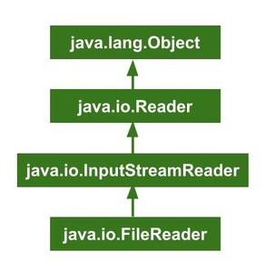
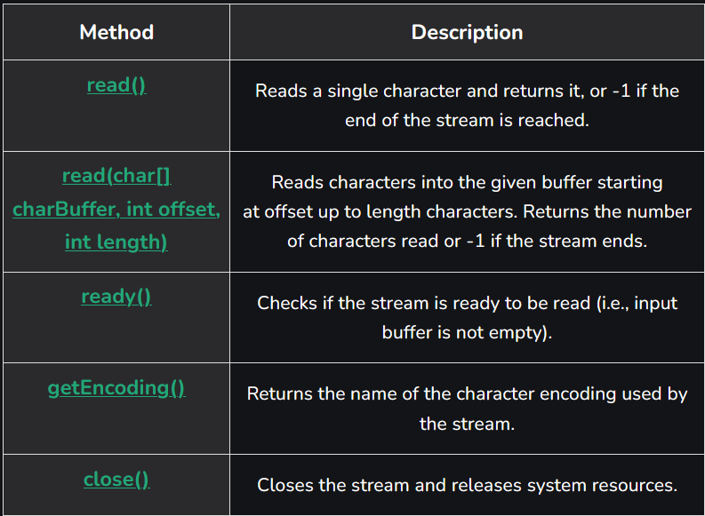
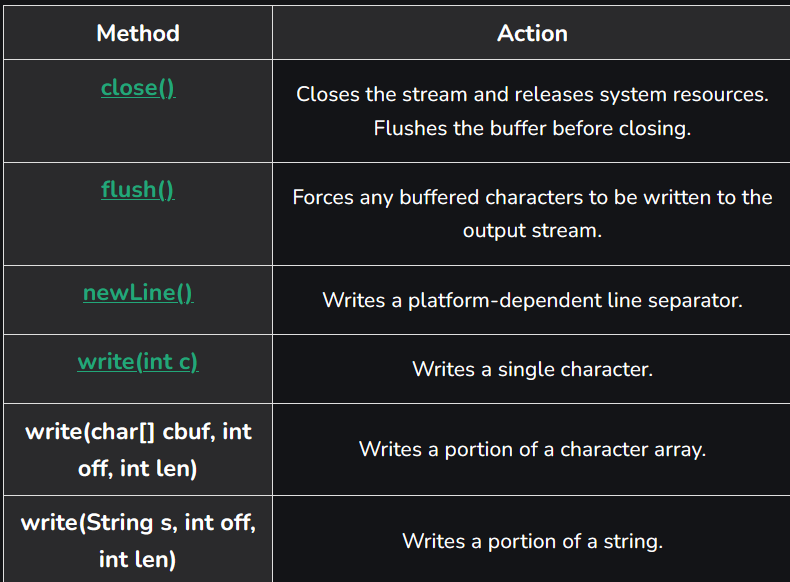
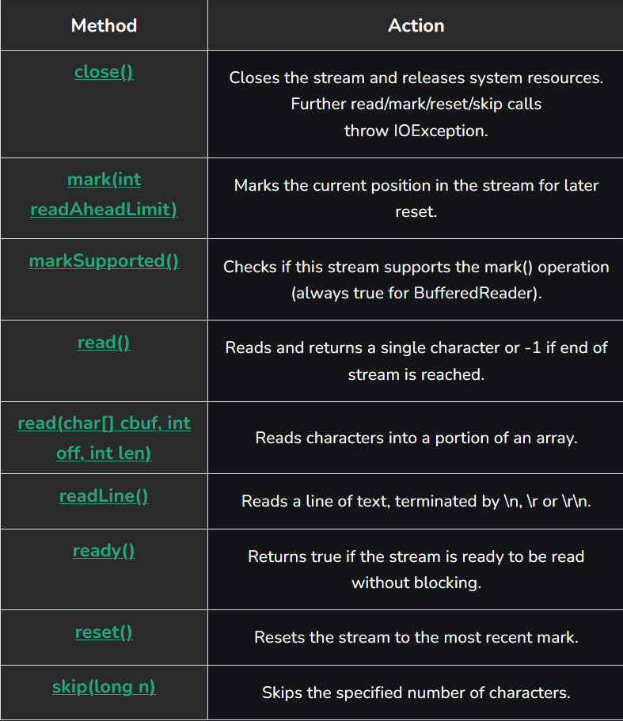

# Part - 3 - FileReader Class

The FileReader class in java is used to read data from a file in the form of characters. It is character-oriented stream that makes it ideal for reading text files. If you want to read binary data(like images or videos) use FileInputStream instead.
- **Character-Oriented** : Reads data as 16-bit Unicode characters.
- **Convenient for Text Files** : Automatically handles character encoding.
- **Platform Independent** : Works across all operating systems.  

**Declaration**

The class declaration of FileRead is as follows: 

```
public class FileReader extends InputStreamReader
```
FileReader is a subclass of InputStreamReader, which in turn extends Reader.

```
Example : Reading Data from a file Using a FileReader

class Test{
    public static void main(String[] args){
        try{

            //FileReader Class used
            FileReader fileReader = new FileReader("example.txt");

            Sop("Reading char by char : \n");
            int i;

            //Using read method
            while((i = fileReader.read()) != -1){
                Sop(char);
            }

            Sop("Reading using array : \n");
            char[] charArray = new char[10];

            // Using read method for to get character array
            fileReader.read(charArray);
            System.out.print(charArray);

            // Close method called
            fileReader.close();
            Sop("FileReader closed!");
        }
        catch (Exception e) {
            Sop(e);
        }
    }
}
```

**Hierarchy of the FileReader class** : 



**Constructor of Java FileReader Class** : 

**FileReader(String fileName)** 

Creates a new FileReader object to read data from a file with the given name.

```
FileReader fr = new FileReader("example.txt");
```

**FileReader(File file)** : 

Creates a new FileReader object to read from the specified File object.
```
File file = new File("example.txt");
FileReader fr = new FileReader(file);
```

**FileReader(FileDescriptor fdObj)** : 

Creates a FileReader using the specified file descriptor. It is often used when working with low-level file landing.
```
FileDescriptor fd = FileDescriptor.in;
FileReader fr = new FileReader(fd);
```

**Methods of Java FileReader Class** : 



**read() Method** :

The read() method of FileReader class in java is used to read and return a single character in the form of an integer value that contain the character's char value. The character read as an integer in the range of 0 to 65535 is returned by this function. If it returns -1 as an int number, it means that all of the data has been read and that FileReader may be closed.

```
public abstract int read();
```

**close() Method** : 

The Reader class provides a way to read character streams. Its close() method is used to close the stream and release any associated resources. 
- If the stream is open, close() closes it and releases any associated resources.
- If the stream is already closed, calling close() has no effect.
- Any read or write operation attempted after closing the stream will throw an IOException.

```
public abstract void close();
```
- **Parameters** : This method does not accept any parameters.
- **Return Type** : This method does not return any value.

**BufferedWriter** : 

Is is used to write text efficiently to character-based output streams. It stores characters in a buffer before writing them to the destination, thereby reducing the number of I/O operations and improving performance.
- **Faster Writing** : Writes large chunks of data at once instead of writing character by character.
- **Easy to Use** : Provides methods like write() and newLine() to simplify text output.

**Class declaration** :

```
public class bufferedWriter extends Writer
``` 
BufferedWriter class extends the Writer class, meaning it is a subclass specialized for buffered character output operations.

**Constructors of BufferedWriter class** : 
1. **BufferedWriter(Writer out)** : Creates a buffered character output stream using the specified writer.
```
BufferedWriter bw = new BufferedWriter(new FileWriter("file.txt"));
```
2. **BufferedWriter(Writer out, int size)** : Creates a buffered character output stream with a custom buffer size.
```
BufferedWriter bw = new BufferedWriter(new FileWriter("file.txt"), 8192);
```
**Methods in BufferedWriter class** : 



**BufferedReader** :

The BufferedReader class in java helps read text efficiently from files or user input. It stores data in a buffer, making reading faster and smoother instead of reading one character at a time.
- **Faster Reading** : Reads large chunks for data at once, reducing the number of read operations.
- **Easy to Use** : Can read text line using the readLine() method.

**Class Declaration** : 
```
public class BufferedReader extends Reader
```

**Constructors** : 

1. **BufferedReader(Reader in)** : Creates a buffered character input stram using the specified read.
```
BufferedReader br = new BufferedReader(new FileReader("file.txt"));
```

2. **BufferedReader(Reader int, int size)** : Creates a buffered character input stream with custom buffer size.
```
BufferedReader br  = new BufferedReader(new FileReader("file.txt"), 8192);
```

**Methods of BufferedReader Class** :

