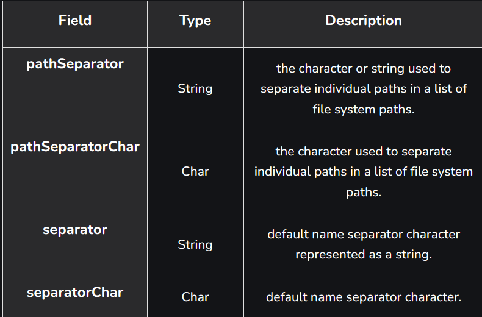
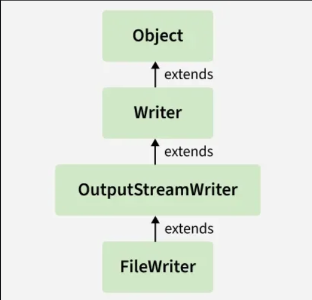
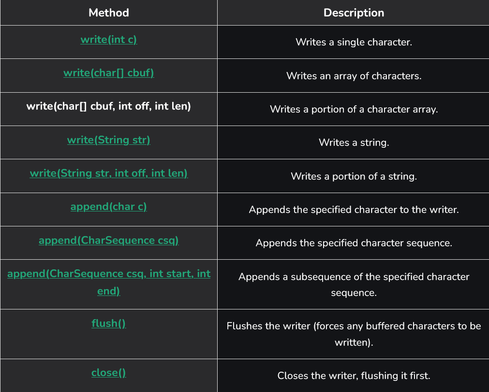
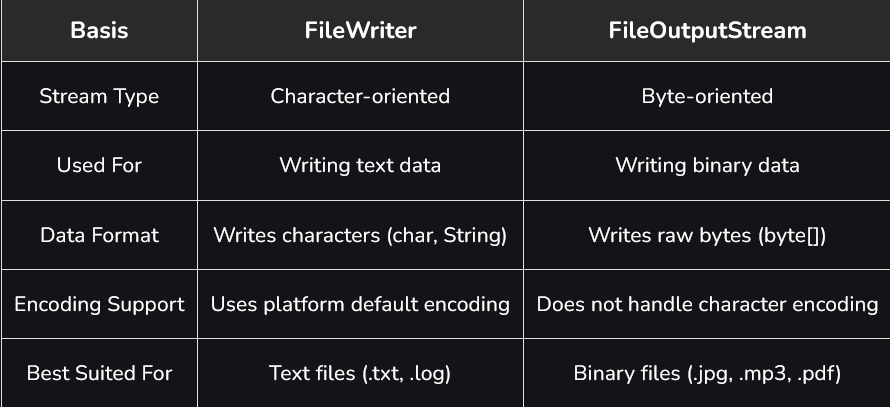

# Part - 1, 2 - Introduction

**Java File Class** : 

The File class in Java is used tp represent the path of a file or folder. It helps in creating deleting, and checking details of files or directories, but not in reading or writing data. It acts as an abstract representation of file and directory names in the system.
- Can retrieve parent directories using the getParent() method.
- A File object is created by passing a file or directory name to its constructor.
- File systems may impose access permissions (read, write, execute).
- Files objects are immutable. Once created, their pathname cannot change.

---

**How to Create a File Object** : 

A File object is created by passing in a string that represents the name of a file, a String or another File object.

```
Syntax : 
File file = new File("path_to_file");
```

**Constructors of Java FIle Class** : 
1. **File(File parent, String child)** : Creates a new file instance from a parent abstract pathname and a child pathname string.
2. **File(String pathname)** : Creates a new File instance by converting the given pathname string into an abstract pathname.
3. **File(String parent, String child)** : Creates a new File instance from parent pathname string and child pathname string.
4. **File(URI url)** : Creates a new file instance by converting the given file : URI into an abstract pathname.

**Note** : If the specified file does not exist, FileWriter constructors will automatically create the file rather than throwing a ```FileNotFoundException```.

**Fields in File Class** : 




---

**Java FileWriter Class** : 

The FileWriter class in Java is used to write character data to files. It extends OutputSteamWriter and handles characters directly, making it ideal for writing text files with either the default or a specified encoding.
- **Character-Oriented Stream** : Designed for writing text (characters).
- **Convenient for Text files** : Works with char, String and char[].
- **Append Option Available** : Can open a file in append mode to add content.

**Class Declaration** : 

```
public class FileWriter extends OutputStreamWriter
```
FileWriter extends OutputStreamWriter, which implements the Writer abstract class.

```
Example : Writing characters to a File using FileWriter class.

class WriteFile{
    public static void main(String[] args){
        Scanner scn = new Scanner(System.in);
        String path = scn.nextLine();

        try (FileWriter writer = new FileWriter(path)){

            String str
                = "Hello Geeks!\nThis is about Programming";
            writer.write(str);

            System.out.println(
                "Data written to the file successfully.");
        }

        catch (IOException e){
            
            System.out.println(
                "An error occurred while writing"
                + " to the file: " + e.getMessage());
        }
    }
}

```

**FileWriter Class Hierarchy** : 



**Constructor of FileWriter Class** :

1. **FileWriter(String fileName)** : Creates a FileWriter for given the file name. 
```
FileWriter fw = new FileWriter("example.txt");
```
1. **FileWriter(String fileName, boolean append)** : Creates a FileWriter for a given file. If append is true, data is added to the end instead of overwriting.
```
FileWriter fw = new FileWriter("example.txt", true);
```

1. **FileWriter(File file)** : Creates a FileWriter for a given File. Throws IOException if the file is a directory, cannot be created or opened.

```
File file = new File("example.txt");
FileWriter fw = new FileWriter(file);
```
4. **FileWriter(File file, boolean append)** : Creates a FileWriter for a given File. If append is true, data is added to the end instead of overwriting.
```
FileWriter fw = new FileWriter(file, true);
```
5. **FileWriter(FileDescriptor fdObj)** : Creates a FileWriter linked to the given file descriptor.

```
FileWriter fw = new FileWriter(FileDescriptor.out);
``` 
**Methods of FileWriter Class** : 



**FileWriter vs FileOutputStream** : 

