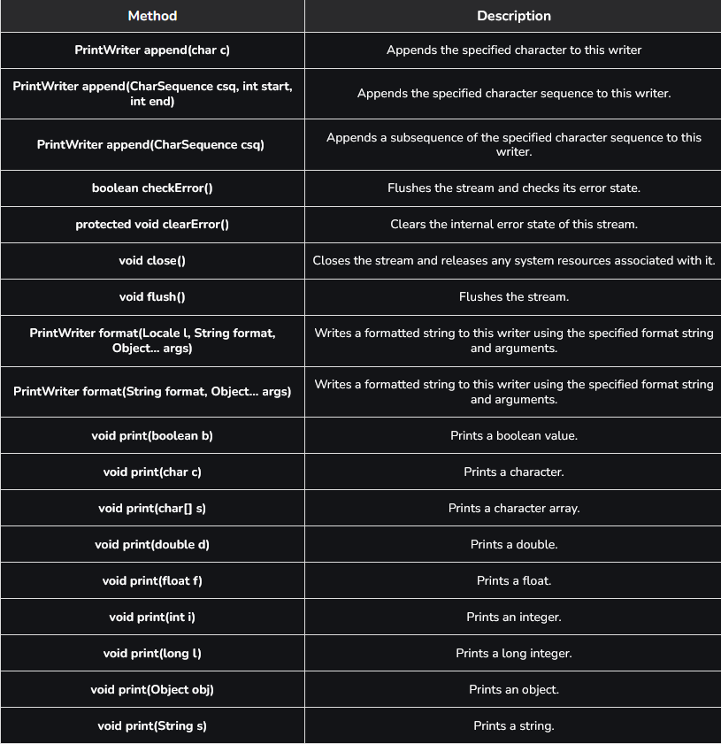

# Part - 4 - PrintWriter

Java PrintWriter class gives Prints formatted represent of objects to a text-output stream. It implements all of the print methods found in PrintStream. It does not contain methods of writing raw bytes, for which a program should use encoded byte streams. Unlike the PrintStream class, if automatic flushing is enabled it will be done only when one of the println, printf, or format methods is invoked, rather than whenever a newline character happens to be output.
It supports writing any type of data (primitives, objects, formatted text) easily.

- These methods use the platform own notion of line separator rather than newline character. 

- Methods in this class never throw I/O exceptions, although some of its constructors may. 

**Declaration of PrintWriter Class** : 
```
public class PrintWriter extends Writer
```

**Constructor and Description**

1. PrintWriter(File file): Creates a new PrintWriter, without automatic line flushing, with the specified file.
2. PrintWriter(File file, String csn): Creates a new PrintWriter, without automatic line flushing, with the specified file and charset.
3. PrintWriter(OutputStream out): Creates a new PrintWriter, without automatic line flushing, from an existing OutputStream.
4. PrintWriter(OutputStream out, boolean autoFlush): Creates a new PrintWriter from an existing OutputStream.
5. PrintWriter(String fileName): Creates a new PrintWriter, without automatic line flushing, with the specified file name.
6. PrintWriter(String fileName, String csn): Creates a new PrintWriter, without automatic line flushing, with the specified file name and charset.
7. PrintWriter(Writer out): Creates a new PrintWriter, without automatic line flushing.
8. PrintWriter(Writer out, boolean autoFlush): Creates a new PrintWriter.

**Methods Of PrintWriter class** :

