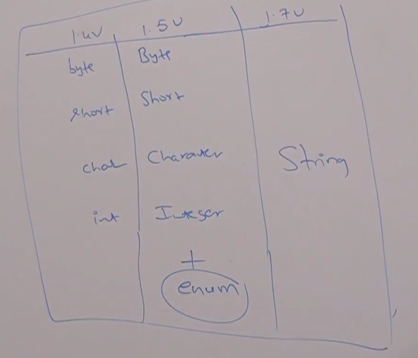

# Part - 1, 2, 3 - Introduction, Selection Statements...

**Flow-Control**

1. Flow control describes the order in which the statements will be executed at runtime.

2. There are three types of flow control statements:

**Selection Statements**
1. if-else
2. switch()
   
**Iterative Statements**
1. while()
2. do-while()
3. for()
4. for-each loop
   
**Transfer Statements**
1. break
2. continue
3. return
4. try-catch finally
5. assert


**Selection Statements**

**if-else**
```
syntax -

    if(b) -> b should be boolean type
    {
        Action if b is true
    }
    else{
        Action if b is false
    }

```
1. The argument to the if statement should be boolean type and if we try to provide any other type then we will get compile time error.

2. Else part and curly braces are optional without curly braces only 1 statement is allowed under if which should not be declarative statement.

```
if(true)
    Sop("Hello"); -> VALID

if(true); -> VALID

if(true)
    int x = 10; -> INVALID - without curly braces only 1 statement is allowed and it shouldn't be a declarative statement

if(true){
    int x = 10; -> VALID
}

```

**Note**:

Theres no dangling else problem in java, every else is mapped to the nearest if statement

```
    if(true)
        if(true)
            Sop("Hello");
    else -> this belong the the nearest if.
        Sop("Hello");

```

**switch** :

1. If several options are available then its not recommend to use nested if-else because it reduces readability to handle this req we should go for switch statement
```
syntax -

switch(x){
    case 1:
        Action-1;
        break;
    case 2:
        Action-2;
        break;
    .
    .
    .
    case n:
        Action-n;
        break;

    default:
        default action;
}

```

2. The allowed arguments types for switch statements are - byte, short, char, int until 1.4v but 1.5v onwards corresponding Wrapper classes and enum type are also allowed. From 1.7v onwards String type is also allowed.



3. Curly braces are mandatory, except switch everywhere curly braces are optional.

4. Both case and default are optional, that is empty switch statement is valid java syntax.

```
eg -

  int x = 10;
  switch(x){

  } -> VALID

```

5. Inside switch every statement should be under case or default i.e independent statements are not allowed in switch otherwise we wil get compile time error.
```
eg -

  int x = 10;
  switch(x){
    Sop("Hello");
  } -> INVALID - (case, default, or } expected)

```

6. Every case label should be constant (constant expression).
```
eg -

  int x = 10;
  int y = 20;
  switch(x){
    case 10:
        Sop(10);
        break;
    case y: -> INVALID - (Constant expression required)
        Sop(20);
        break;
  }

if we declare "y" as final then we wont get any compile time error.
```
7. Both switch argument and case label can be expression but case label should be constant expression
```
eg -

  int x = 10;
  switch(x + 1){
    case 10:
        Sop(10);
        break;
    case 10 + 20 + 30 + 40:
        Sop(60);
  }

```
8. Every case label should be in the range of switch argument type otherwise we get CompileTimeError.
```
eg -

  byte b = 10;
  switch(b){
    case 10:
        Sop(10);
        break;
    case 100:
        Sop(100);
        break;
    case 1000:
        Sop(1000);
        break;
  } -> INVALID - (Possible loss of precision)

```
9. Duplicate case labels are not allowed. It will give C/E - (Duplicate case level)
```
eg -

  int x = 10;
  switch(x){
    case 97:
        Sop(97);
        break;
    case 98:
        Sop(98);
        break;
    case 99
        Sop(99);
        break;
    case 'a':  -> INVALID - (Duplicate case label)
        Sop('a');
  }

```
10. Within the switch if any case is matched from that case onwards all statements will be executed until break or end of the switch this is called fall through. the main adv of this is we can define common actions for multiple cases (code reusability).

11. Within the switch we can default case at most once, default executes only when no case matches but execution can still enter default through fall-through if previous case has no break. Within the switch we can write default case anywhere but its recommended to write it as last case.

12. break terminates switch immediately without break execution continues into next cases which is called fall-through.

**Modern switch enhancements** :
1. Java 14 introduced switch expressions.
```
eg -
    int day = 2;

    String result = switch(day){
        case 1 -> "Monday";
        case2 -> "Tuesday";
        default -> "Invalid";
    }
```

1. Benefits of this enhanced switch are clearer syntax, no fall through by default and can return values directly


**Diff b/w if-else and switch** :

**if-else**:
1. It is best for ranges and complex conditions.
2. it supports relational and logical operators.

**switch** :
1. It is best for equality-based multiple options.
2. Helps in improving readability.

```
eg - if(age > 20) -> This cannot be done directly in traditional switch.

```