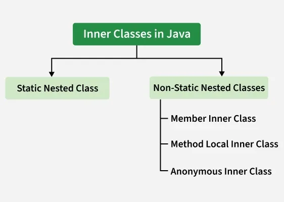

# Part - 1 - Inner class.

An inner class is a class declared inside the body of another class. The inner class has access to all members (including private) of the outer class, but the outer class can access the inner class members only through an object of the inner class.

```
Syntax :
    class OuterClass{

        class InnerClass{

        }
    }
```

```
Example

public class OuterClass{
    class InnerClass{
        void Display(){
            Sop("Inner Class");
        }
    }

    public static void main(String[] args){
        OuterClass outer = new OuterClass();
        InnerClass inner  = outer.new InnerClass();
        inner.display();
    }
}

O/P -> Inner Class
```

**Features of Inner Class** :
1. **Encapsulation** : Inner classes can access private members of the outer class, providing better encapsulation.
2. **Code Organization** : Logically groups classes that belong together, making code more readable.
3. **Access to Outer Class** : Inner class instances have a reference to the outer class instance.
4. **Namespace Management** : Helps avoid naming conflicts by nesting related classes. 

**Types of Inner Classes** :

1. Member Inner Class.
2. Method-Local Inner Class.
3. Static Nested Class.
4. Anonymous Inner Class.



**Member Inner Class** :

A member inner class is a non-static class defined at the member level of another class. It has access to all members of the outer class, including private members.

```
class Outer{
    private int outerVar = 100;

    //Member Inner Class
    class Inner{
        void Display(){
            Sop("Outer Var: " + outerVar);
        }
    }
}

class Main{
    public static void main(String[] args){
        Outer.Inner inner = new Outer().new Inner();
        inner.display();
    }
}

O/P -> Outer Variables: 100
```

1. Member inner class cannot have static members (except static final constants) until Java 16.
2. Must be instantiated with outer class instance.
3. **Syntax** : Outer.Inner inner = outer.new Inner();

**Before Java 16** : member inner classes count NOT have static members (except static final constants).

**Method-Local Inner Class** :

A method-local inner class is defined inside a method of the outer class. It can only be instantiated within the method where it is defined.

```
class Outer{
    void outerMethod(){
        Sop("Inside outerMethod");

        //Method-local inner class
        class Inner{
            void InnerMethod(){
                Sop("Inside innerMethod");
            }
        }

        Inner inner = new Inner();
        inner.innerMethod();
    }
}

class Main{
    public static void main(String[] args){
        Outer outer = new Outer();
        outer.Method();
    }
}

O/P -> Inside outerMethod
Inside innerMethod
```

**Accessing Local Variables** :

From Java 8 onwards, method-local inner classes can access effectively final or final local variables.

```
class Outer{
    void OuterMethod(){
        int x = 98; // final
        Sop("Inside outerMethod");

        class Inner {
            void innerMethod(){
                Sop("x = " + x);
            }
        }

        Inner inner = new Inner();
        inner.innerMethod();
    }
}

class Main{
    public static void main(String[] args){
        Outer outer  = new Outer();
        outer.outerMethod();
    }
}

O/P -> inside outerMethod x = 98
```
1. Cannot access non-final local variables before Java 8.
2. From Java 8 onwards, can access effectively final local variables.
3. Cannot be declared as ```private```, ```protected```, ```static``` or ```transient```.
4. Can be declared as ```abstract``` or ```final```, but not both.

**Static Nested Classes** :

A static nested class is a static class defined inside another class. It does not have access to instance members of the outer class but can access static members.

```
class Outer{
    private static int staticVar = 50;

    // Static nested class
    static class Inner{
        void display(){
            Sop("Static variables : " + staticVar);
        }
    }
}

class Main{
    public static void main(String[] args){
        Outer.Inner inner = new Outer.Inner();
        inner.Display();
    }
}

O/P -> Static variable: 50
```

**Anonymous inner Classes** :

An anonymous inner class is an inner class without a name. It is declared and instantiated in a single statement. It is used to provide a specific implementation of a class or interface on the fly.

**Types of Anonymous Inner Classes** :
1. **As a Subclass** : 
```
class Demo{
    void show(){
        Sop("Inside demo show method");
    }
}

class main{
    public static void main(String[] args){
        Demo obj = new Demo(){
            @Override
            void show(){
                super.show();
                Sop("Inside Anonymous class");
            }
        };
        obj.show();
    }
}

O/P -> Inside Demo's show method
Inside Anonymous class
```

2. **As an interface Implementation** :
```
interface Hello{
    void greet();
}

class Main{
    public static void main(String[] args){
        Hello hello = new Hello(){
            @Override 
            public void greet(){
                Sop("Hello from Anonymous class");
            }
        };

        hello.greet();
    }
}
```
1. Declared and instantiated in one statement.
2. Used for one-time use implementations.
3. Cannot have constructors (since it has no name).
4. Commonly used in event handling and functional programming.