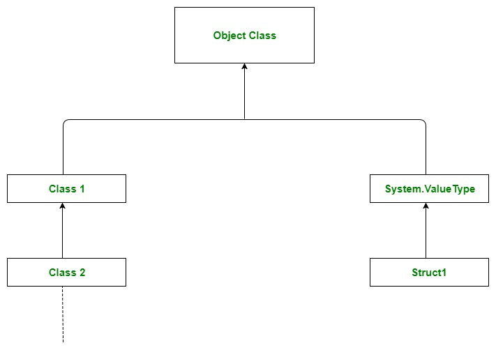
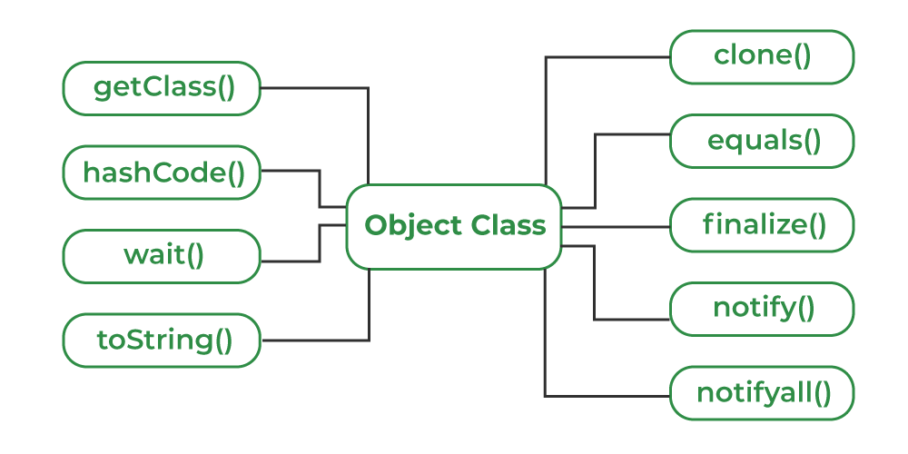

# Part - 1, 2 - Object Class.

Java.lang package in Java.

Provides classes that are fundamental to the design of the java which is the root of the class hierarchy, and Class, instances of which represent classes at runtime.

Following are the important classes in Java.lang package :

1. Boolean 
2. Byte
3. Character
4. Compiler
5. Double

**Object Class** :

Object class (in Java.lang) is the root of the Java class hierarchy. Every class in java either directly or indirectly extends Object. It provides essential methods like toString(), equals(), hasCode(), clone() and several others that support object comparison, hashing, debugging, cloning and sync.
1. Acts as the root of all Java classes.
2. Defines essential methods shared by all objects.
3. Supports thread communication (wait(), notify(), notifyAll())



```
class Person{
    String n;

    @Override
    public String toString(){
        return "Person{name:'" + n " '}";
    }

    public static void main(String[] args){
        Person p = new Person("geek");

        Sop(p.toString());
        Sop(p.hashCode());
    }
}

O/P -> Person{name:'Geek'}
321001045
```

**Object Class Methods** :

There are 11 key methods. As the root of the java class hierarchy, these methods are automatically inherited by every java class.



**Non final methods (Can be overridden)** :
1. ```toString()``` : Returns a string representation of the object.
2. ```equals(Object obj)``` : Compares the reference equality of two objects.
3. ```hashCode()``` : Returns a distinct integer hash value for the object.
4. ```clone()``` : Creates and returns a shallow copy of the object.
5. ```finalize()``` : Invoked by the garbage collector before deleting an object (deprecated).

**Final Methods (Cannot be Overridden)** :
1. ```getClass()``` : Returns the runtime ```class``` metadata object of this object. 
2. ```notify()``` : Wakes up a single thread waiting on the object's monitor.
3. ```notifyAll()``` : Wakes up all threads waiting on the object's monitor.
4. ```wait()``` : Causes the current thread to wait until notified.
5. ```wait(long timeout)``` : Waits for notification.
6. ```wait(long timeout, int nanos)``` : Provides higher precision timeout waiting 


**hashCode()** : 

1. The ```java.lang.reflect.Method.hasCode()``` method returns the hash code for the Method class object.
2. The hash code returned is computed by exclusive or operation on the hash codes for the methods declaring class name and the methods name.
3. The hash code is always the same if the object doesn't change.
4. Hash code is a unique code generated by the JVM at time of object creation.
5. It can be used to perform some operation on hashing related algorithms like hashtable, hashmap etc.
6. An object can also be searched with this unique code.
7. It is not the memory address of the object

```
Syntax : 

public int hashCode();
```
It returns an integer value which represent hashCode value.

