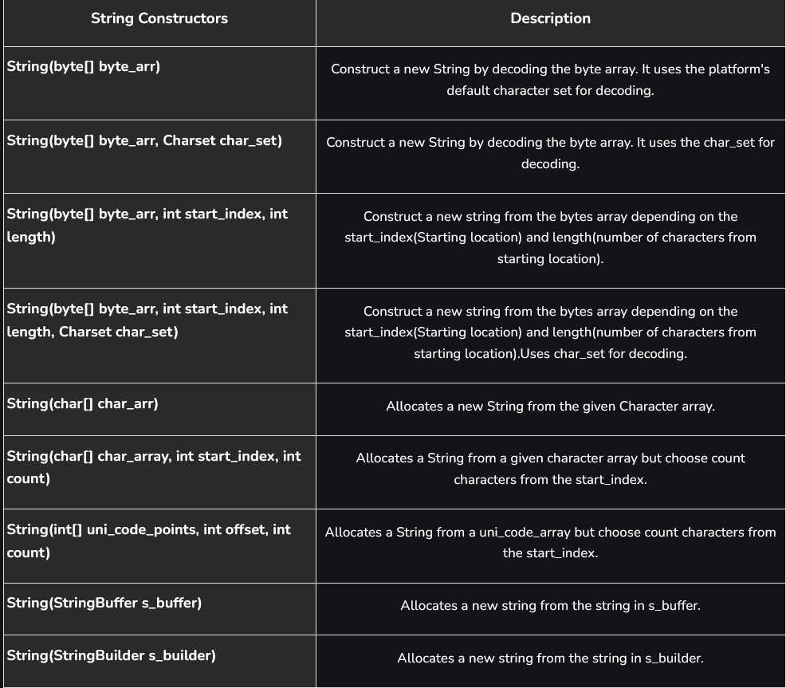
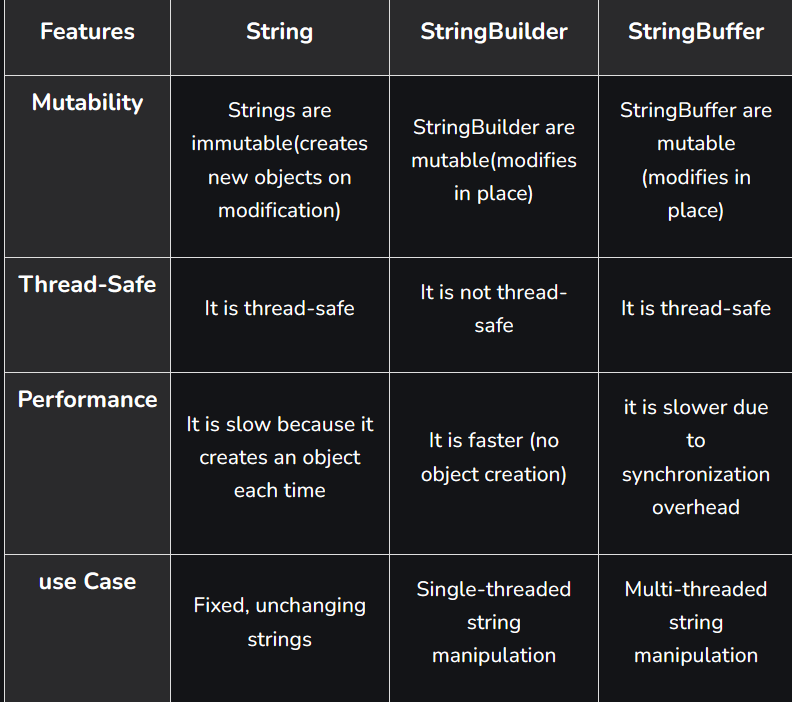

# Part - 5, 6 - String class.

String class in java represent a sequence of characters and is widely used for handling textual data. It provides various methods for creating, comparing and manipulating strings. String objects are immutable, meaning their values cannot be changed after creation.

- Stored in the String Pool to optimize memory usage and reuse objects.
- Immutable nature ensures better security and thread safety.
- Can be created using string literals or new keyword.

**Key Features** :

**1.Immutable** : 

Immutable means that once a String object is created, its value cannot be changed.

```
Example :

public class Main{
    public static void main(String[] args){
        String text = "hello";
        text.charAt(0) = 'H'; // Compile-time error
    }
}
```
**Explanation** : String is immutable in java, we you cannot modify its characters directly.

**2. Thread-Safe** : 

String in Java is tread-safe because it is immutable, allowing safe access by multiple threads without synchronization.

**3. Supports Various Utility Methods** : 

String is a predefined final class in Java present in java.lang.package. It provides various methods to create, manipulate and compare strings, like ```length()```, ```charAt()```, ```concat()```, ```equals()```.
```
Class Test{
    public static void main(String[] args){
        String str = "Hello";
        Sop("Length" + str.length());
    }
}

O/P -> HELLO
```

**4. Implements Interfaces** :

The String class in java implements three important interfaces.

- **CharSequence** : Allows access to characters in the string using chatAt(), length() etc. 
- **Comparable<String>** : Enables comparing two string lexicographically using compareTo().
- **Serializable** : Allows string objects to be converted into a byte stream.

**String Constructor** :

String constructors are used to create new String objects from different sources like character arrays, byte arrays or another string. Although strings in java are usually created using strings literals, the String class also provides constructors for more control.

```
public class Test{
    public static void main(String[] args){

        // Constructor 1 : Creating string using new keyword
        String str = new String("Hello Java");
        Sop("String using new keyword : " + str1);

        // Constructor 2 : Creating string from character array
        char[] charArray = {'J', 'A', 'V', 'A'};
        String str2 = new String(charArray);
        Sop("String from char array: " + str2);
    }
}

O/P -> String using new keyword  : Hello Java
String from char array : JAVA
```

**String constructor table** :




**String Buffer** : 

String buffer class in java represents a sequence of characters that can be modified, which means we can change the content of the StringBuffer without creating a new object every time. It represents a mutable sequence of characters.
- Unlike String, we can modify the content of the StringBuffer without creating a new object.
- All Methods of StringBuffer are synchronized, making it safe to use in multithreaded environments.
- Ideal for scenarios with frequent modifications like append, insert, delete or replace operations.

```
public class Test{
    public static void main(String[] args){
        
        //Creating String Buffer
        StringBuffer s = new StringBuffer();

        s.append("Hello");
        s.append(" ");
        s.append("World");

        String str = s.toString();
        Sop(str);
    }
}

O/P -> Hello world 

```

**StringBuilder** : 

StringBuilder is a mutable sequence of characters introduced in Java 5. It allows modification of the string content without creating new objects.

```
public class Test{
    public static void main(String[] args){
        StringBuilder sb = new StringBuilder("Hello");
        sb.append(" World");
        Sop(sb);
    }
}

O/P -> Hello World
```

**StringBuilder vs String vs StringBuffer** :



**Java Strings are stored in Heap** : 

String is a class and string in java are treated as an object hence the object of string of String class will be stored in Heap, not in the stack area.