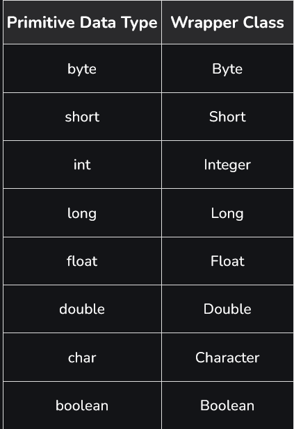
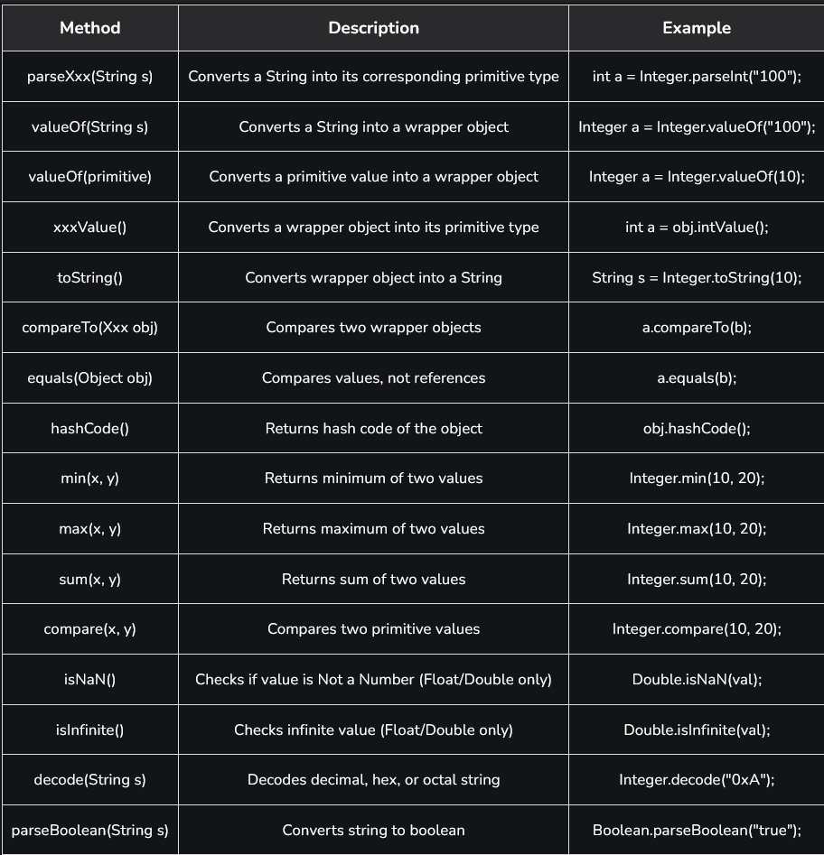

# Part - 8 - Wrapper class

Wrapper classes allow primitive data types to be represented as objects. This enables primitives to be used in object-oriented features such as collections, generics and APIs that require objects.
- Each wrapper class encapsulates a corresponding primitive value inside an object (Integer for int, Double for double).
- Java provides wrapper classes for all eight primitive data types to support object-based operations.

```
Exmaple : Converting Primitive to Wrapper (Autoboxing)

class Test{
    public static void main(String[] args){
        int b = 357;

        // Autoboxing : primitive int -> Integer Object
        Integer a = b;

        Sop("The primitive int b is: " + b);
        Sop("The Integer object a is: " + a);
    }
}

O/P -> The primitive int b is: 357
The Integer object a is: 357
``` 

**Why wrapper classes are needed** : 
- Java collections (ArrayList, HashMap etc) store only objects not primitives.
- Wrapper objects allow primitive to be used in object-oriented features like methods, synchronization and serialization.
- Objects support null values, while primitives do not.
- Wrapper classes provide utility methods such as compareTO(), equals() and toString().

**Autoboxing** : 
 
The automatic conversion of primitive types of the objects of their corresponding wrapper classes is known as autoboxing. For example conversion of int to integer, long to Long, double to Double.

```
class Test{
    public static void main(String[] args){
        char ch = 'a';

        // Autoboxing: char -> Character
        Character c = ch;

        ArrayList<Integer> list = new ArrayList<>();

        //Autoboxing : int -> Integer
        list.add(25);
        Sop(list.get(0));
    }
}

O/P -> 25
```

**Unboxing** : 

Is is the automatic conversion of a wrapper class object back into its corresponding primitive types.

```
class Test{
    public static void main(String[] args){
        Character ch = 'a';

        //Unboxing: Character -> char
        char c = ch;

        ArrayList<Integer> list = new ArrayList<>();
        list.add(24);

        // Unboxing: Integer -> int
        int num = list.get(0);

        Sop(num);
    }
}

O/P -> 24

```
**Primitive Data Types & Wrapper Classes** : 




**Common Methods of Wrapper Classes** : 

