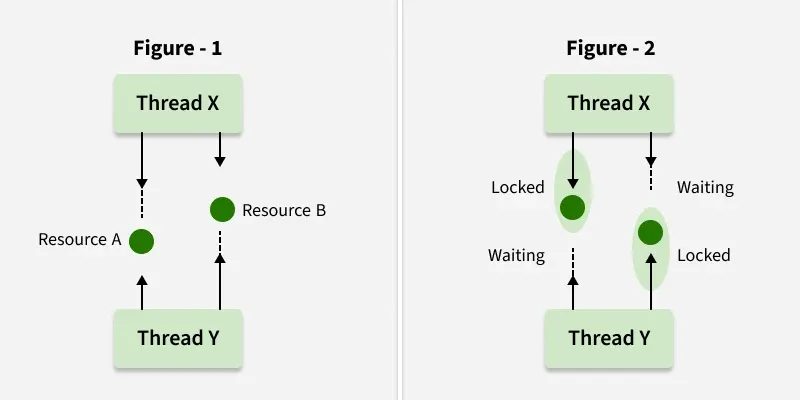
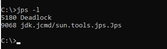

# Part - 12 - Deadlock

Deadlock is a situation in multithreading where two or more threads are permanently blocked because each one is waiting for the other to release a required lock. 
1. Each thread holds a lock and waits for another lock held by a different thread.
2. This creates a circular wait, causing the application to freeze indefinitely.

**Locks in java** :

Locks are mechanisms used to control access to shared resources in a multithreaded environment




**Detecting Deadlocks** :

We can detect deadlocks in a running java program using the following steps

1. List the active java processes :

```
jps -l

```
**Response**



This will list the running java processes and also mention that there is a deadlock if we want to generate a thread dump.

2. Identify the process ID (PID) of the target program and run :
```
jcmd <PID> Thread.print 
```

This command outputs the state of the threads

**Preventing Deadlocks** :

We can avoid deadlock condition by knowing its possibilities. It's a very complex process and not easy to catch. Still if we try, we can avoid this. There are some methods by which we can avoid this condition, We cant completely remove its possibility but we can reduce it.
1. Avoid Nested Locks : This is the main reason for deadlock. Mainly happens when we give locks to multiple threads. Avoid giving lock to multiple threads if we already have given to one.
2. Avoid Unnecessary Locks : We should have lock only those members who are required. Having a lock on unnecessarily can lead to deadlock.
3. Using thread join : Deadlock condition appears when one thread is waiting for the other to finish. If this condition occurs we can use Thread.Join with the maximum time you think the execution will take.

**Starvation** : 

In starvation threads are also waiting for each other. But here waiting time is not infinite after some interval of time, waiting thead always get the resources whatever is required to execute thread run() method.