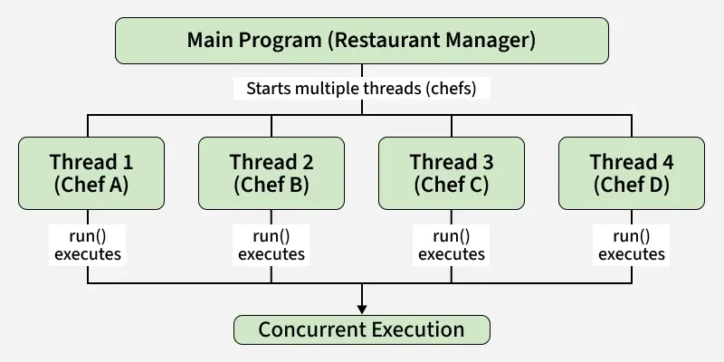

# Part - 1 - Introduction

Multithreading in java is a feature that enables a program to run multiple threads simultaneously, allowing tasks to execute in parallel and utilize the CPU more efficiently. A thread is a lightweight, independent unit of execution inside a program(process).

1. Threads allows parallel execution of tasks.
2. A process can have multiple threads.
3. Each thread runs independently but shares the same memory.

```
Example -> Imagine a restaurant kitchen. Multiple chefs (threads) are preparing different dishes at the same time. This speeds up service and utilizes all available resources (CPU).
```


**Different ways to create Threads.**

Threads can be created by using two mechanisms :

1. **Extending the thread class :**

We create a class that extends Thread and override its run() method to define the task. Then we make an object of this class and call start(), which automatically calls run() and begins the thread execution.

```
class Cooking extends Thread{
    private String task;

    Cooking(String task){
        this.task = task;
    }

    public void run(){
        Sop(task + "is being prepped by" + Thread.currentThread.getName());
    }
}

public class Restaurant{
    public static void main(String args[]){
        Thread t1 = new Cooking("Pasta");
        Thread t2 = new Cooking("Salad");

        t1.start();
        t2.start();
    }
}
O/P -> Rice is prepped by Thread-2, Salad is prepped by Thread-1.
```

**Note** : The order of thread execution may vary on each run because thread scheduling is non deterministic.

2. **Implementing the Runnable interface :**

We create a new class which implements java.lang.Runnable interface and define the run() method there. Then we instantiate a Thread object and call start() method on this object.

```
class Cooking implements Runnable{
    private String task;

    Cooking(String task){
        this.task = task;
    }

    public void run(){
        Sop(task + "is being prepped" + Thread.currentThread.getName());
    }
}

public class RestaurantRunnable{
    public static void main(String args[]){
        Thread t1 = new Thread(new Cooking("Soup"));
        Thread t2 = new Thread(new Cooking("Salad"));

        t1.start();
        t2.start();
    }
}

O/P -> Salad is being prepped by Thread-1, Soup is being prepped by Thread-2
```

**Best use case for Thread and Runnable** :
1. Use extends Thread : If your class does not extends any other class.
2. Use implements Runnable : If your class already extends another class(preferred because java doesn't support multiple inheritance).

**Advantages of Multithreading** :

1. **Improved Performance** : Multiple tasks can run simultaneously, reducing execution time.
2. **Efficient CPU utilization** : Threads keep CPU busy by running tasks in parallel.
3. **Responsiveness** : Applications (like GUIs) remain responsive while performing background tasks.
4. **Resource Sharing** : Threads within the same process share memory and resources, avoiding duplication.