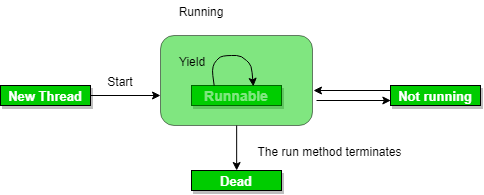
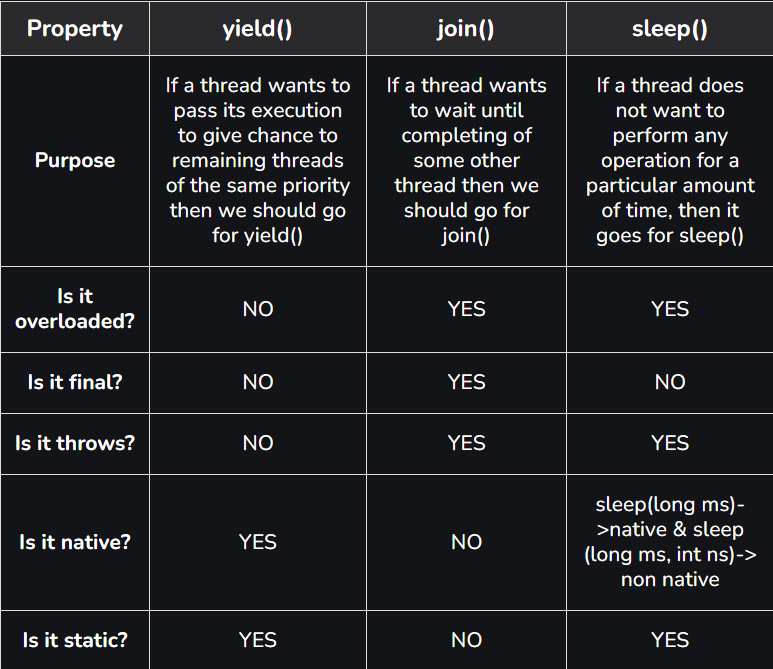

# Part - 5 - Java concurrency

We can prevent the execution of a thread by using one of the following methods of the Thread class. All three methods will be used to prevent the thread from execution.

**yield() method** :
1. Suppose there are three threads t1, t2 and t3. Thread t1 gets the processor and starts its execution and thread t2 and t3 are in Ready/Runnable state.
2. The completion time for thread t1 is 5 hours and the completion time for t2 wait for 5 hours to just finish 5 min job. In such scenario where one thread is taking too much time to complete its execution, we need a way to prevent the execution of a thread in between if something important is pending. 
3. yield() helps us in doing so.
4. The yield() basically means that the thread is not doing anything particularly important and if any other threads or processes need to be run they should run.



**Use of yield method** :

1. Whenever a thread calls java.lang.Thread.yield method gives hint to the thread scheduler that it is ready to pause its execution. The thread scheduler is free to ignore this hint.
2. If any thread executes the yield method, the thread scheduler checks if there is any thread with the same or high priority as this thread. If the processor finds any thread with higher or same priority then it will move the current thread to Ready/Runnable state and give the processor to another thread and if not the current thread will keep executing.
3. Once a thread has executed the yeild method and there are many threads with the same priority is waiting for the processor, then we cant specify which thread will get the execution chance first.
4. The thread which executes the yeild method will enter in the Runnable state from Running state.
5. Once a thread pauses its execution, we cant specify when it will get a chance again it depends on the thread scheduler.
6. The underlying platform must provide support for preemptive scheduling if we are using the yield method.

**sleep() method** :

This method causes the currently executing thread to sleep for the specified number of milliseconds, subject to the precision and accuracy of the system timers and schedulers.

```
Syntax

// sleep for the specified number of ms
public static void sleep(long millis) throws InterruptedException
```
```
Example

public class SleepDemo implements Runnable{
    Thread t;
    public void run()
    {
        for (int i = 0; i < 4; i++) {
            System.out.println(
                Thread.currentThread().getName() + "  "
                + i);
            try {
                // thread to sleep for 1000 milliseconds
                Thread.sleep(1000);
            }

            catch (Exception e) {
                ThreSystem.out.println(e);
            }
        }
    }
}

public static void main(String[] args){
    Thread t = new Thread(new SleepDemo());

    t.start();

    Thread t2 = new Thread(new SleepDemo());

    t2.start();
}

O/P ->

Thread-1  0
Thread-0  0
Thread-0  1
Thread-1  1
```

**join() method** :
1. The join() method of a Thread instance is used to join the start of a thread's execution to the end of another thread's execution such that a thread does not start running until another thread ends. 
2. If join() is called on a Thread instance, the currently running thread will block until the Thread instance has finished executing.
3. The join() method waits at most this many ms for this thread to die
4. A timeout of 0 means to wait forever

```
Syntax
//waits for this thread to die
public final voi join() throws InterruptedException

//waits at most this much ms for this thread to die
public final void join(long ms) throws InterruptedException

//waits at most ms plus ns for this thread to die.
java.lang.Thread.join(long ms, int ns)
```

```
Example

public class JoinDemo implements Runnable{
    public void Run(){
        Thread t = Thread.currentThread();
        Sop("Current thread: " + t.getName());

        Sop("Is Alive" + t.isAlive());
    }
}

public static void main(String[] args){
    Thread t = new Thread(new JoinDemo());

    t.start();

    t.join(1000);

    Sop("\nJoining after 1000"+ " milliseconds: \n");
    Sop("Current thread: "+ t.getName());

    // Checks if this thread is alive
    Sop("Is alive? " + t.isAlive());
}

O/P -> 
Current thread: Thread 0
Is alive? true

Joining after 1000 milliseconds

Current thread: Thread-0
Is Alive? false
```

**Notes** :
1. If any executing thread t1 calls join() on t2 i.e t2.join() immediately t1 will enter into waiting state until t2 completes its execution.
2. Giving timeout within join(), will make the effect of join() null after the timeout.

**Comparison** :

