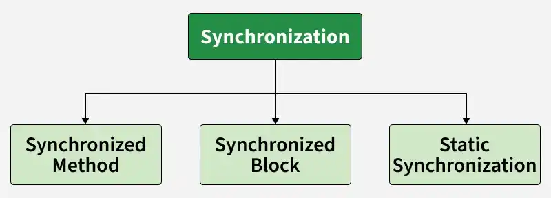
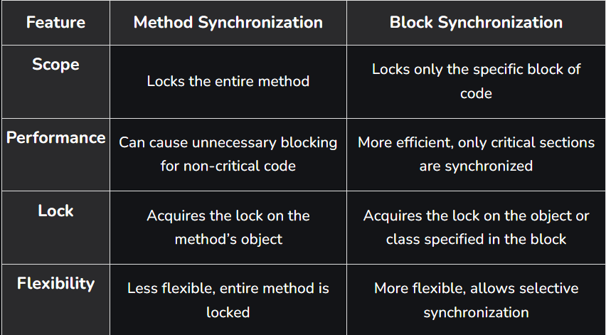
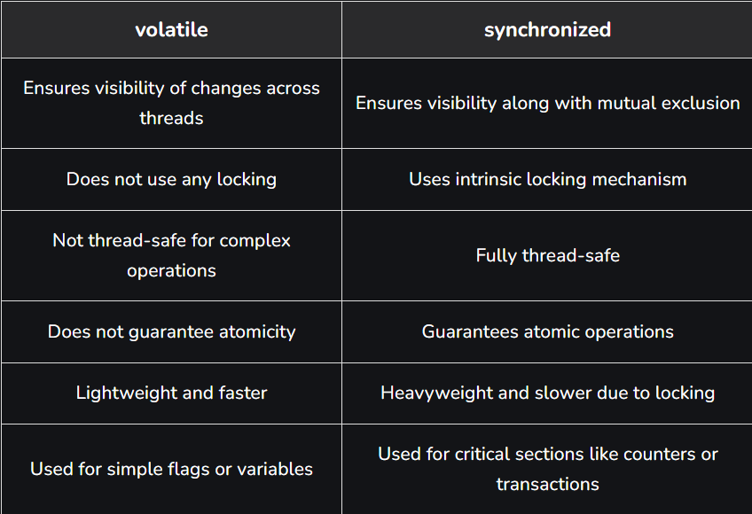

# Part - 7 - Synchronization

**Synchronization** :

It is used to control the execution of multiple process of threads so that shared resources are accessed in a proper and orderly manner. It helps avoid conflicts and ensures correct results when many tasks run at the same time.

1. It controls the access of shared resources.
2. It avoids data inconsistency.
3. It ensures proper execution of processes.
4. synchronized keyword cannot be applied to variables. 

**Ways to Achieve Synchronization** :



**Synchronization Methods** :

Synchronization methods are used to lock an entire method so that only one thread can execute it at a time for a particular object. This ensures safe access to shared data but may reduce performance due to full method locking.

1. Locks the whole method, not just a part of it.
2. Uses the object-level lock (instance lock).

```
class Counter{

    //Shared variable
    private int c = 0;

    //Synchronized method to increment counter
    public synchronized void inc(){
        c++;
    }

    public synchronized int get(){
        return c;
    }
}

public class Geeks{
    public static void main(String[] args){
        
        Counter cnt = new Counter();

        Thread t1 = new Thread() -> {
            for (int i = 0;i < 1000; i++){
                cnt.inc;
            }
        }

        Thread t2 = new Thread(() -> {
            for (int i = 0; i < 1000; i++)
                cnt.inc();
        });

        t1.start();
        t2.start();

        try {
            t1.join();
            t2.join();
        }
        catch (InterruptedException e) {
            e.printStackTrace();
        }

        System.out.println("Counter: " + cnt.get());
    }
}

O/P -> Counter : 2000

Both threads increment the same counter concurrently. Since the inc() and get() methods are synchronized, only one thread can access them at a time, ensuring the correct final count.
```

**Synchronized Blocks** :

Allow locking only a specific section of code instead of entire method. This makes the program more efficient by reducing the scope of synchronization.
1. Locks only the critical section of code, not the entire method.
2. Provides better performance due to fine-grained control.4

```
class Counter{
    private int c = 0;
    
    public void inc(){
        synchronized (this) {
            c++;
        }
    }

    public int get(){
        return c;
    }
}

public class Geeks{
    public static void main(String[] args) throws InterruptedException{
        Counter cnt = new Counter();

          Thread t1 = new Thread(() -> {
            for (int i = 0; i < 1000; i++)
                cnt.inc();
        });

        Thread t2 = new Thread(() -> {
            for (int i = 0; i < 1000; i++)
                cnt.inc();
        });

        t1.start();
        t2.start();
        t1.join();
        t2.join();

        System.out.println("Counter: " + cnt.get());
    }
}

O/P -> Counter: 2000

The synchronized block ensures mutual exclusion only for the increment statement, reducing the locking overhead.
```

**Difference B/W Method Vs Block synchronization** :



**Important Points** : 
1. A thread entering a synchronized method/block acquires a lock, it releases it upon exit
2. Instance method/blocks Acquire object-level lock.
3. Static methods/blocks Acquire class-level lock.
4. Synchronization on null objects throws NullPointerException.
5. wait(), notify(), notifyAll() are key method in synchronization.

**Static Synchronization** :

It is used when static data or method need to be protected in a multithreaded environment. It ensures that only one thread can access the class-level resource at a time.

1. Locks at the class level instead of the object level.
2. Shared across all instances of the class.

```
class Table{
    synchronized static void printTable(int n){
        for (int i = 1; i <=3; i++){
            
            System.out.println(n * i);
            try {
            } catch (Exception e) {
                System.out.println(e);
            }
        }
    }
}

class Thread1 extends Thread{
    
    public void run() {
        Table.printTable(1);
    }
}

class Thread2 extends Thread {
    public void run() {
        Table.printTable(10);
    }
}

public class GFG{
    
    public static void main(String[] args){
        
        Thread1 t1 = new Thread1();
        Thread2 t2 = new Thread2();
        t1.start();
        t2.start();
    }
}
```

**Types of Synchronization** :

**Process Synchronization** :

It is a fundamental concept in operating system that ensures multiple processes or thread can execute safely while sharing common resources. 

It is used to coordinate the execution of multiple processes. It ensures that the shared resources are safe and in order.

1. It prevents race conditions by controlling access to shared resources.
2. Ensures data consistency and integrity in concurrent execution.


**Thread Synchronization** :

Thread synchronization is used to coordinate and ordering of the execution of the threads in a multi-thread program. There are two types of thread synchronization

1. Mutual Exclusive.
2. Cooperation

**Volatile Keyword** :

It ensures that all threads have a consistent view of a variable's value. It prevents caching of the variable's value by threads, ensuring that updates to the variable are immediately visible to other threads.

**Working of Volatile Modifier** :
1. It applies only to variables.
2. volatile guarantees visibility, any write to a volatile variable is immediately visible to other threads.
3. It does not guarantee atomicity, meaning operations like count++ can still result in inconsistent values

**Difference B/W Volatile and Synchronized** :

