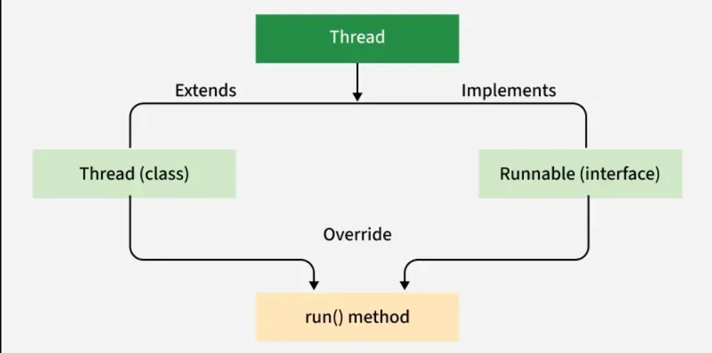
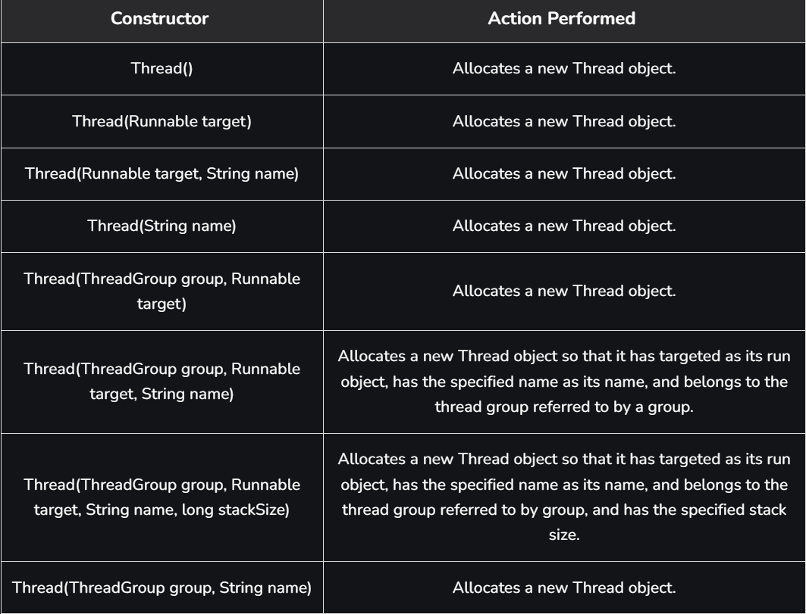
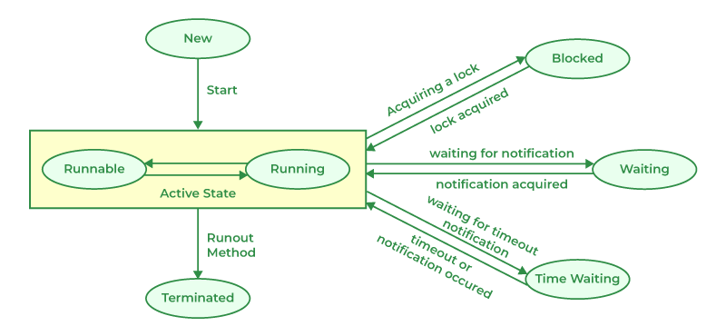

# Part - 2 , 3, 4- Threads

**Threads** :

A thread is the smallest unit of execution within program. It is a lightweight subprocess that runs independently but shares the same memory space as the process, allowing multiple tasks to execute concurrently.

**Ways to create thread**:



1. Extending Thread class.
2. Implementing a Runnable interface.

**Extending Thread class** :

Create a class that extends Thread. Override the run() method, this is where you put the code that thread should execute.
Then create a object of your class and all the start() method. This will internally call 
run() in a new thread.

```
class MyThread extends Thread{
    public void run(){
        String str = "Thread running";
        Sop(str);
    }
}

public class Test{
    public static void main(String[] args){
        MyThread t1 = new MyThread();
        t1.start();
    }
}

O/P -> Thread running
```

**Using Runnable interface** :

Create a class that implements Runnable. Override the run() method, this contains the code for the thread. Then create a Thread object, pass your Runnable object to it and call start().
```
class MyThread implements Runnable{
    public void run{
        String str = "Thread is running";
        Sop(str);
    }
}

public class Test{
    public static void main(String[] args){
        MyThread t1 = new MyThread();

        //init Thread object
        Thread t2 = new Thread(g1);

        //Running the thread
        t2.start();
    }
}

O/P -> Thread is running
```
**Note** : Extend Thread when you don't need to extend any other class. Implement Runnable when your class already extends another class.

**Thread class constructor** :




**Thread Scheduler** :

1. The thread scheduler is a part of the JVM responsible for selecting a thread for execution from multiple ready threads.
2. It does not gurantee a fixed order of execution, because the excat behaviuour is platform dependent.
3. In java, the scheduler mainly works with threads in the Runnable state and moves one of them to the Running state.

**Main Responsibilities** :

1. Choose one thread among many ready threads.
2. Gives CPU time to threads based on priority and availablity.
3. Helps in fair execution using time slicing or preemptive behvaiour depending on the system.
4. Improves CPU utilization in multithreaded programs.

**Thread priority** :

Java uses priorities from 1 to 10.
1. ```MIN_PRIORITY = 1```
2. ```NORM_PRIORITY = 5```
3. ```MAX_PRIORITY = 10```

A thread's priority can be changed using ```setPriority()```.
Higher priority threads are generally preferred, but java doesn't guarantee that a higher-priority thread will always run first.

**Scheduling types** :
1. Preemptive scheduling: A running thrrad can be be paused so another thread can run.
2. Time slicing: Each thread gets CPU for a small time slice, then control may move to another thread.

**Note** : The exact type depends on the JVM and operating system.

**Thread.start()** :

The start() method is used to begin a new thread of execution. It performs two main tasks:
1. Allocates resources for a new thread.
2. Call the runs() method internally in the new thread.
3. Once thread is started, and has completed it tasks and is now dead we cannot restart the same thread.

```
class MyThread extends Thread{
    public void run(){
        Sop("Thread running");
    }

    public static void main(String args[]){
        MyThread t1 = new MyThread();

        t1.start();
    }
}
O/P -> Thread running
```
**Thread.run()** :

The run() method contains the code executed by the thread. However, calling run() directly does not create a new thread. Instead, it behaves like a normal method call executed in current thread.
```
class MyThread extends Thread{
    public void run(){
        Sop("Thread running");
    }

    public static void main(String[] args){
        MyThread t1 = new MyThread();
        
        //Does not start a new thread.
        t1.run();
    }
}

Here, run() method is executed in the main thread, so no multithreading occurs.
```

**Thread Life cycle** :

The lifecycle of a thread in java defines the various states a thread goes through from its creation to termination.

1. A thread passes through multiple states during execution.
2. The thread scheduler controls state transitions.
3. Helps in efficient thread management and debugging.



**New** :

A thread is in the new state when it is created but has not yet started execution,so its code has not begun running.

```
public static final Thread.State NEW
```

**Runnable** :

Thread state for runnable thread. A thread in the runnable state is executing in thr JVM but it may be waiting for other resources from the OS such as processor.

```
public static final Thread.State RUNNABLE
```

**Blocked** :

A thread is in the blocked state when it is waiting to acquire a lock that is currently held by another thread.

```
public static final Thread.State BLOCKED
```

**Waiting** :

Thread state for a waiting thread. A thread is in the waiting state due to calling one of the following methods:
1. Object.wait with no timeout
2. Thread.join with no timeout
3. LockSupport.park

```
public static final Thread.State WAITING
```

**Timed Waiting** :

Thread state for a waiting thread with a specified waiting time. A thread is in the timed waiting state due to calling one of the following methods with a specified positive waiting time:
1. Thread.sleep
2. Object.wait with timeout
3. Thread.join with timeout

```
public static final Thread.State TIMED_WAITING
```

**Terminated** :

Thread state for a terminated thread. The thread has completed execution.
```
public static final Thread.State TERMINATED
```
