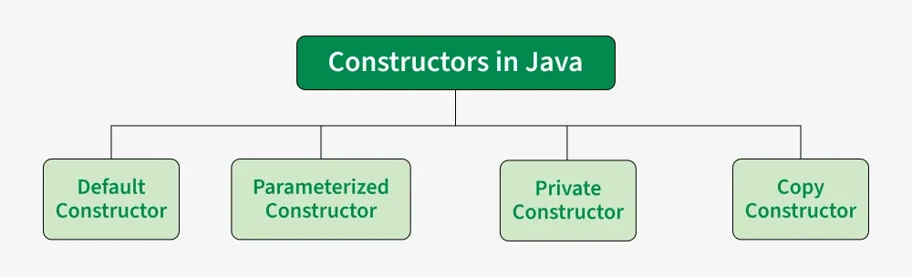
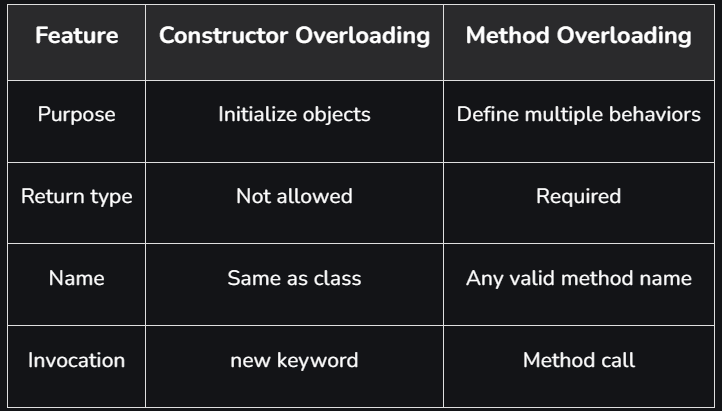

# Part - 14, 15, 16 - Constructor

**Constructor** :
1. It is a special member that ic called when an object is created.
2. It initializes the new object state.
3. It is used to set default user-defined values for the object's attributes.
4. A construct has the same name as the class.
5. It does not have a return type, not even void.
6. It can accept parameters to initialize object properties.

```
class Student{
    String name;

    Student(String name){
        this.name = name;
    }
}
```
**Types of constructors** :



**Default Constructor** :
1. A default constructor has no parameters.
2. It is used to assign default values.
3. If no constructor is explicitly defined, Java will provide a default constructor.
```
Class Test{

    //Default Constructor
    Test(){
    
        Sop("Default constructor");
    }
}

O/P -> Default constructor
```

**Note** : It is not compulsory to write a constructor for a class because the java compiler automatically creates a default constructor if your class doesn't have any.

**Parameterized Constructor** :
1. A constructor that as parameters is known as Parameterized constructor.
2. If we want to initialize fields of the class with our own values , the we should use Parameterized constructor.

```
Class Test{

    String name;
    String id;

    //Parameterized Constructor
    Test(String name, String id){
        
        this.name = name;
        this.id = id;
    }
}
```

**Copy Constructor** :
1. Unlike other constructors copy constructor is passed with another object which copies the data available from the passed object to the newly created object.
```
class Test{
    String name;
    String id;

    // Parameterized Constructor
    Test(String name, String id){
        
        this.name = name;
        this.id = id;
    }

    Test(Test obj2){
        this.name = obj2.name;
        this.id = obj2.id;
    }
}
```

**Note** : Java does not provide a built in copy constructor like C++. We can create our own by writing a constructor that takes an object of the same class as a parameter and copies it fields.

**Private Constructor** :
1. A private constructor cannot be accessed from outside of the class.
2. It is commonly used in
   
   Singleton Pattern: To insure only one instance of class is created.
   
   Utility/Helper class: To prevent instantiation of a class containing only static methods.

```
class Test{

    private Test(){

        Sop("Private constructor");
    }

    public static void Display(){
        Sop("Hello :");
    }
    
}

class main{
    public static void main(String[] args){
        
        Test.Display();
    }
}

```
**Note** : The Test constructor is declared private, so an Object of Test cannot be created in main(). The class is accessed only through static method display(), which is called directly using the class name.

**Constructor Overloading** :
1. This is a key concept in OOP related to constructors is constructor overloading.
2. This allows us to create multiple constructors in the same class with different parameter lists.
3. The appropriate constructor is selected at compile time based on the arguments passed during object creation.
4. Constructor overloading enables objects to be initialized in multiple ways .
```
class Test{
    
    Test(String name){
        
        Sop("One argument");
    }

    Test(String name, int age){

        Sop("two argument");
    }

    Test(Long id){

        Sop("One argument but different type");
    }
}
```

**Different b/w Constructor Overloading and Method Overloading** :



**Rules for using this() in Constructors** :

1. Constructor call must be the first statement in the constructor.
2. Recursive constructor calls are not allowed.
3. A constructor can call only one other constructor.
