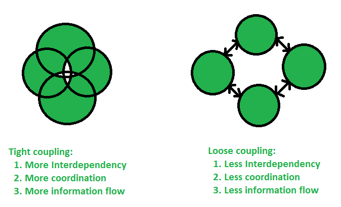
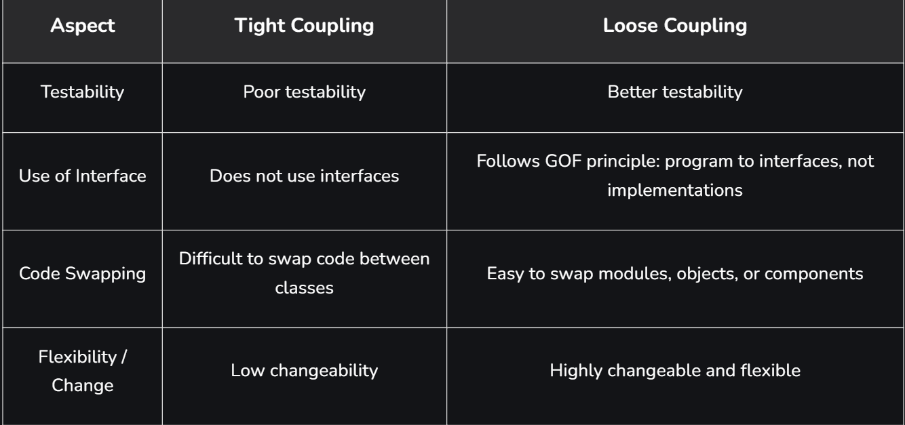
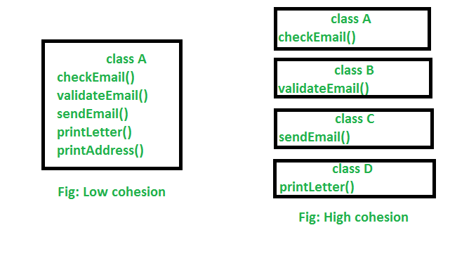

# Part - 8 - Coupling

**Coupling** :

1. It refers to the degree of dependency between classes or modules in a java application.
2. If one class heavily depends on another, then they are said to be tightly coupled.
3. Light coupling is preferred because it makes codes more maintainable, flexible and testable.

**Types of coupling** :

1. Tight coupling :

It occurs when two classes are strongly dependent on each other. If one class knows the internal details of another class, any change in one class will directly affect the other.

```
eg - If your skins is permanently attached to your body design, changing one requires changing the other.
```

2. Loose coupling :

It means classes are minimally dependent on each other and communicate through interfaces and abstractions instead of concrete implementations.
Frameworks like Spring achieve loose coupling using Dependency injections (DI).

```
eg - You can change your shirt without changing your body.
```

**Tight coupling VS Light coupling** :

1. Loose coupling is better than tight coupling because it improves flexibility, reusability and testability.
2. In a loosely coupled design, changes or growth in the application affect only few components, making the system easier to maintain and scale.



**Difference B/W tight coupling and loose coupling** :



**Cohesion** :

1. Cohesion in java is the Object-oriented principle most closely associated with making sure that a class is designed with a single, well-focused purpose.
2. In object-oriented design, cohesion refers to how a single class is designed.
3. **Note** : The more focused a class is, the more is the cohesiveness of that class.
4. The advantage of high cohesion is that such classes are much easier to maintain(less frequently changed) than classes with low cohesion.
5. Another benefit of high cohesion is that classes with a well focused purpose tend to be more reusable than other classes.



Above we can see in low cohesion only one class is responsible to execute lots of jobs that are not common which reduces the chance of reusability and maintenance. But in high cohesion there is a separate class for all the jobs to execute a specific job.

**Object Type casting** :

1. We can use parent reference to hold child objects

```
Object o = new String("Durga");
```
2. We can use interfaces reference to hold implemented class objects.

```
Runnable r = new Thread();
```

**Class type casting** :

Typecasting is the assessment of the value of one primitive data type to another type. In java , there are two types of casting

**Upcasting :**

1. Is the typecasting of a child object to a parent object.
2. It gives us flexibility to access the parent class members but its not possible to access all the child class members using this feature.
3. We can access the overridden methods.

```
Parent p = new Child();

Animal myAnimal = new Dog(); //Upcasting
```

**Downcasting** :

1. Is the process of casting a superclass reference to back to its subclass type.
2. It is used to access methods or attributes that exist only in the subclass and are not avaiable through the more general superclass reference.

```

Child c = (Child) p;

Dog mydog = (Dog) myAnimal; //Downcasting
````
