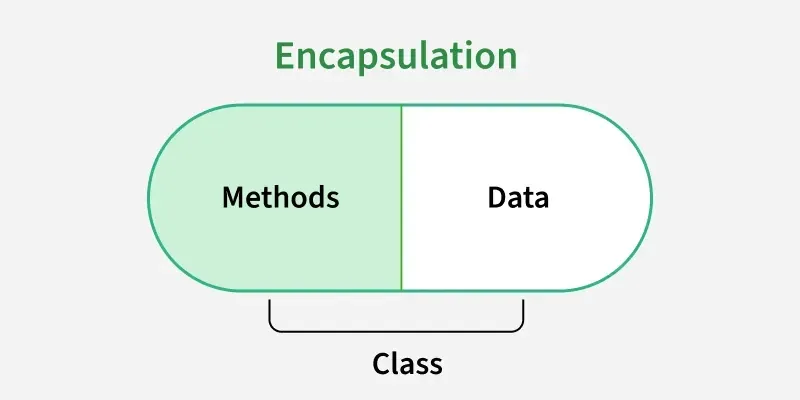

# Part - 1 - Introduction

**OOPs** :

1. Object-Object Programming is a programming paradigm based on concept of objects that contain data and behavior
2. If focuses on designing software that closely represent real-world entities.

**Data Hiding** :

1. It is a technique used to restrict direct access to an object's internal state, ensuring the data can be accessed from or modified through authorized methods.
2. By declaring member(variable) as private we can achieve data hiding.
3. Primary goal is to enhance security and data integrity.

```
public class Account{
    
    private double bal;

    public double getBalance(){
        return bal;
    }
}
```
1. The main advantage of data hiding is security.
2. It is highly recommended a variable as private.

**Abstraction** :

1. It is a process of hiding internal implementation details while showing only the essential features of an object to the user.
2. It focuses on what an object does rather than how it does it.
3. It reduces complexity and improvise maintainability.
4. By using interfaces and abstract classes we can implement abstraction.

**Encapsulation** :

1. The process of biding data and corresponding methods into a single unit is called encapsulation.
2. It restricts direct access by hiding implementation details. This ensures controlled interaction with the data.
3. It is achieved by using access modifiers like private, protected and public.
4. It improves data security by allowing validation through getter and setters.

<br>

