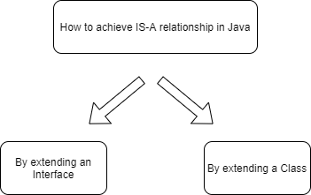
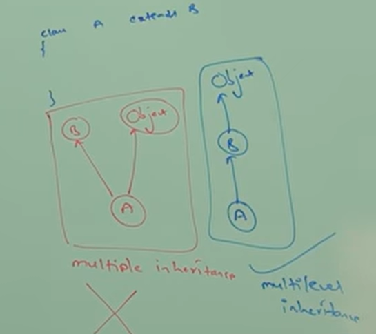
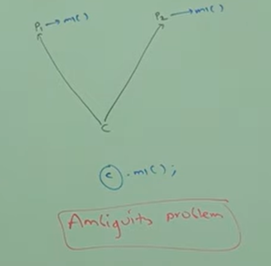

# Part - 2, 3 - Is A Relationship & Has A Relationship.

**Is-A relationship** :

1. It is also known as inheritance.
2. Whenever one class inherits another class, it is called IS-A relationship.

```
class P{
    
    public void m1(){
        Sop("Parent");
    }
}

class C extends P{

    public void m2(){
        Sop("child");
    }
}
```

3. Whatever methods parent has by default is available to child and hence on the child reference we can call both parent and child class methods.
4. Whatever methods child has by default is not available to the parent and hence on the parent reference we cant call child methods.
5. Parent reference can be used to hold child object but using that reference we cant call child methods but we can call methods present in parent class.
6. Parent reference can be used to hold child object but child reference cannot be used to hold parent object.

<br>



**Multiple inheritance** :

1. A java class can't extend more than one class at a time, hence java wont provide support for multiple inheritance in class
```
class A extends B,C{

}
```
2. If our class dosen't extends any other class then only our class is direct child class of object
3. If our class extends any other class then our class is indirect child class of object

<br>



4. Due to ambiguity problem java does'nt provide support for multiple inheritance.

<br>



5. Cyclic inheritance is not allowed and its not required in java.

```
class A extends A{

}

class A extends B{

}

class B extends A{

}
```

**Has-A Relationship** :
1. It is also known as Composition or Aggregation.
2. Occurs when a class uses an instance of another class as member variable.
```
class Car{
    Engine e = new Engine();
}

class Engine{

    //functionality
}

Car Has-A Engine reference
```

**Composition** :
1. Also known as Strong Bonding.
2. The child object cannot exist without the parent object.
```
Eg - a Car HAS-A Engine. If the car is destroyed, the engine is also gone.
```

**Aggregation** :
1. Also known as Weak Bonding.
2. Both entities can exist independently.
```
Eg - Library HAS-A Student. If the library closes, the student still exists.
```

**Overloading** :
1. Method overloading in java allows a class to have multiple methods with the same name but different parameters
```
a1(int i);

a1(long l);

a1(float f);
```