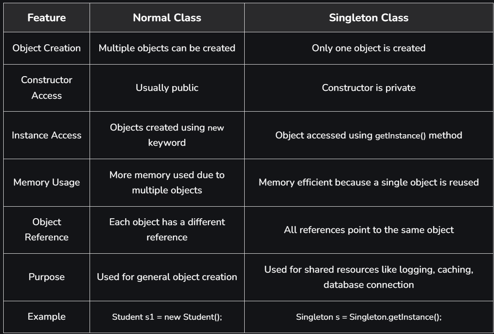

# Part - 17 - Singleton

**Singleton Method Design Pattern** :

1. This ensures that a class has only one instance and provides a global access point to it.
2. It is used when we want centralized control of resources, such as managing database connections, configuration settings or logging.
3. It prevents accidental creation of multiple instances and ensures controlled, efficient use of resources like memory and connections.
4. Simplifies coordination across different parts of the application by providing a single shared instance.
5. The constructor is made private to prevent creating multiple objects from outside of class.
6. Allows only one object of the class to be created.
7. Provides global access to same instance.
8. Helps save memory by reusing the same object.

**Purpose of Singleton Class** :

1. The main purpose is to ensure that only one object of the class is created during the entire application lifecycle.
2. It provides a single global access point to shared resources like database connections, sockets, caches and configuration.
3. **Memory Efficient** : The object is created only once and reused whenever needed, reducing memory usage and object creation overhead.
4. **Resource Control** : Helps manage shared resources efficiently in applications such as caching, logging, thread pooling and database connectivity.
5. **Thread Safety** : Ensures that only one thread or one connection accesses a shared resource at a time in multi-threaded env.
6. Examples of Singleton classes - Runtime class,  Action Servlet, Service Locator. Private constructors.

**Types of Singleton class** :

1. Early Instantiation : The object is created at the time of class loading.
2. Lazy Instantiation : The object is created only when it is required for the first time.

**Creating a Singleton class** :
1. Create a private constructor to prevent direct object creation from outside of class.
2. Declare a private static variable to store the single instance of the class.
3. Create a public static method (getInstance()) that returns the same instance every time using the lazy Initialization approach.
4. This ensures that only one object of that class is created throughout the application.

**Difference B/W Normal Class VS Singleton Class** :

