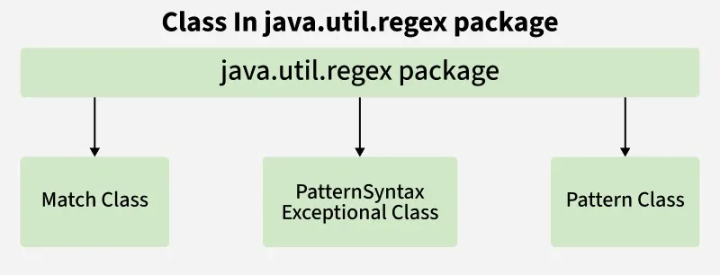
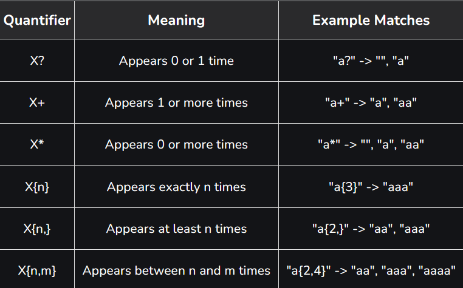

# Part - 1 - Regular Expression

Regular Expressions (Regex) in Java area sequence of characters used to define a search pattern for text precessing tasks. They help in efficiently matching, searching, and manipulating string based on specific rules.
- Used for validating input formats like email, phone numbers, and passwords.
- Helps in searching and extracting specific patterns from large text data.
- Supports powerful text manipulation operations such as find and replace.



Regular Expression are supported through the java.util.regex package, which mainly consists of the fOllowing classes: 
- **Pattern** : Defines the regular expression.
- **Matcher** : Used to perform operations such as matching, searching and replacing.
- **PatternSyntaxException** : Indicates a syntax error in the regular expression.

**Pattern Class** : 

The Pattern class compiles regex strings into pattern objects.

**Methods** : 
- **compile(String regex)** : Compiles a regex.
- **matcher(CharSequence input)** : Creates a matcher to search a string.
- **matches(String regex, CharSequence input)** : Checks full-string match.
- **split(CharSequence input)** : Splits input based on the pattern.

```
class PatternEg{
    public static void main(String[] args){
        Sop(Pattern.matches("geeks.*", "geeksforgeeks"));
    }
}

O/P -> true
```

**Matcher Class** : 

The matcher class performs matching operations for input strings.

**Key methods** : 
- **find()** : Searches for pattern occurrences.
-  **start()/end()** : Returns start and end indices of a match.
-  **group()/groupCount()** : Retrieves matched subsequences.
-  **matches()** : Checks if the entire input matches the pattern.
```
class MatcherEg{
    public static void main(String[] args){
        Pattern p = Pattern.compile("geeks");
        Matcher m = p.matcher("geeksforgeeks.org");

        while(m.find()){
            Sop("Pattern found" + m.start() + "to" + (m.end() -1));
        }
    }
}
O/P -> Pattern found from 0 to 4
Pattern found 8 to 12
```

**Regex Character Class** : 

- **[xyx]** : Matches x,y or z.
- **[^xyz]** : Matches any character except x,y or z.
- **[a-zA-Z]** : Matches any character in the specified range.
- **[a-f[m-t]]** : Union of ranges a-f and m-t.
- **[a-z && [^m-p]]** : Intersection of a-z excluding m-p.

```
class CharClass{
    public static void main(String[] args){
        Sop(Pattern.matches("[a-z]", "g"));
    }
}
O/P -> true
```
**Regex Quantifiers / Metacharacters**: 



```
Sop(Pattern.matches("\\d{4}", "1234")); true
```

**Common Regex Patterns in Java** :
- . : Any character
- \d : Digit [0-9]
- \D : Non-digit
- \s : Whitespace
- \S : Non-whitespace
- \w : Word character [a-zA-Z0-9_]
- \W : Non-word character
- \b : Word boundary
- \B : Non-word boundary

**Notes** :
- Use Pattern.compile() to create a regex pattern.
- Use matcher() on a Pattern to perform matches.
- Pattern.matches() validates the whole string, while Matcher.find() searches for multiple occurrences.
- Regex can split text, validate input and extract data efficiently in java.