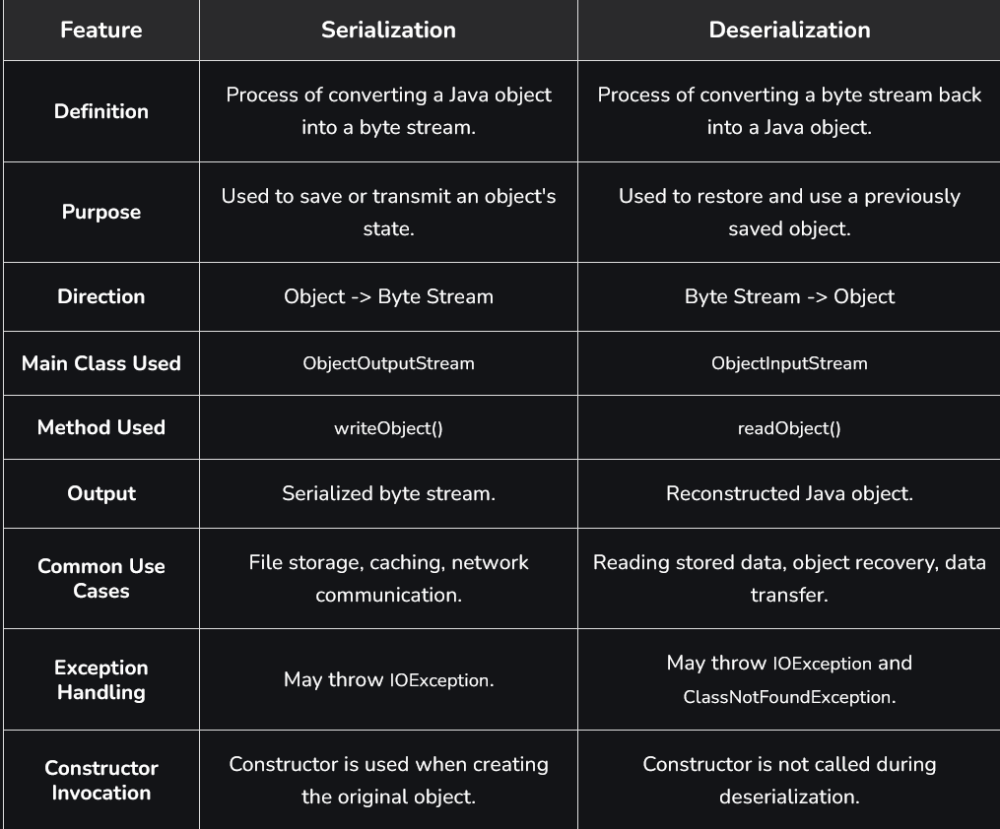

# Part - 1 - Introduction

Serialization and Deserialization are important Java mechanisms used to convert objects into a byte stream and reconstruct them back into objects. Together, they enable object persistence, data transfer, and communication between different systems while preserving an object's state.
- Serialization converts an object into a byte stream for storage or transmission.
- Deserialization converts the byte stream back into the orignal java object.

**Serialization** :

The serialization process converts a Java object into a byte stream, allowing it to be stored or transmitted while preserving its state. Since the generated byte stream is platform-independent, an object serialized on one platform can be deserialized on another platform.
- Implemented using the Serializable marker interface.
- Enables object persistence by saving object data to files or databases.
- Facilitates object transfer across networks in distributed applications.


**Serialize Interface** :

It is a marker interface available in the java.io.package. It is used to indicate that the objects of a class can be converted into a byte stream (serialization) and later reconstructed back into objects (deserialization). since it is a market interface, it does not contain any methods or fields and is mainly used to object persistence and data transfer.
- Works with ObjectOutputStream and ObjectInputStream.
- Helps save and restore the state of an object.
- Allows object to be transmitted over a network.

```
Syntax :

public interface Serializable
```

```
Example :

class Student implements Serializable{
    int id;
    String name;
}
```

**Object Graph** :

An object graph is a group of objects that are linked through references, where one objects points to another. In other words, we can say that when we serialize any object and if it contains any other object reference, then JVM serializes the object and as well as it object references.

**Key features** :
- When an object is serialized, all referenced objects in the graph are also serialized automatically. 
- Every object in the graph must implement the Serializable interface otherwise, A NotSerializableException will be thrown.
- We can use a transient keyword to prevent the serialization of specific fields.


**SerialVersionUID** :

SerialVersionUID is a unique version identifier for a Serializable class. during deserialization, it ensures that the serialized object and the corresponding class have compatible versions.
- Used to verify version compatibility during serialization and deserialization.
- Prevents deserialization of objects when class definitions are incompatible.
- If the SerialVersionUID values do not match, an InvalidClassException is thrown.
```
Syntax :

private static final long serialVersionUID = 3L;
```

- If serialVersionUId is not declared, Java automatically generates one based on the class structure.
- Explicitly declaring it is recommended because automatic generation may change when the class is modified or compiled differently.
- Using the private access modifier is preferred since serialVersionUID is not intended to be inherited.

**Deserialization** :

The Deserialization process converts a byte stream into its original java object, restoring the object's state and data. This allows previously serialized objects to be retrieved and used within the application
- Performed using the ObjectInputStream class.
- Recreates objects from data previously saved through serialization. 
- Helps retrieve and use stored object data without manual reconstruction.


**Serialization vs Deserialization** :

