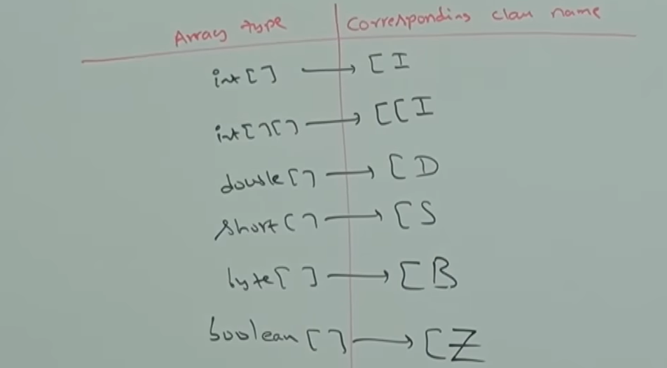
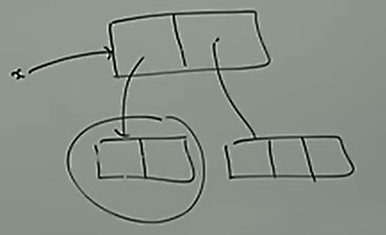

# Part - 6, 7, 8 & 9 - Arrays

**Introduction** :

1. An array is an indexed collection of fixed number of homogenous (same type) data elements.
   
2. Main adv of arrays is huge no.of values single variable so that readability can be improved.

3. The main disadv of array is its fixed in size.

4. Once array is created we cannot change the size.

5. Every array in java is an object therefore we can create array by using "new" keyword.

6. For every array type corresponding classes are available and these classes are part of java lang and not available at programmer level

**Array Declaration** :

1. One dimensional array :
   
    int[] x ; -> this is the recommend format of declaration syntax.
    
    At the time of declaration we cant specify the size this will cause compile time errors.

2. Two dimensional array :
   
   Valid declarations -
        int[][] x;
        
        int [][]x;
        
        int x[][];
        
        int[] []x;
        
        int[] x[];
        
        int []x[];

3. Three dimensional array :
    
    Valid declarations -
        
        int[][][] a;
        
        int [][][]a;
        
        int a[][][];
        
        int[] [][]a;
        
        int[] a[][];
        
        int[] []a[];
        
        int[][] []a;
        
        int [][]a[];
        
        int []a[][];

**Array & its Class names** :



These class names aren't available at programmer level

**Creation**

1. At the time of creation we should define the size of the array otherwise we will get compile time errors
    
        eg - int[] x = new int[6];

2. Its okay to have an array with size "0" in java.
   
        eg - int[] x = new int[0];

3. If we try to define the size of an array with negative value then we will get "NegativeArraySizeException"
   
        eg - int[] x = new int[-3];

4. To specify array size allowed data types are - byte, short, char, int.

<br>

**Default Values of Arrays** :

    int  = 0

    boolean = false

    String/Object = null

    char = '\u0000' (empty unicode character)

**Arrays of Array Approach (AOA)** :

1. Java uses Arrays of Array approach for implementing/creation of 2-d arrays.
   
2. One adv of the AOA approach is better memory utilization because each row can have different sizes.

3. This allows the uses of Jagged Array/Ragged Array

```
    eg - int[][] arr = {
        {1,2},
        
        {3,4,5},
        
        {5}
    }
```

**Memory structure and Java Code**



```
    int [][] x = new int[2][];
    
    x[0] = new int[2];

    x[1] = new int[3];

```

**Array Initialization**:

1. Every array created is init by default value which is "0" this is only applicable for numeric arrays.
2. We can override these default values.
   ```
   eg - int[] x = new int[6]; -> now all the elements are 0;
        
        x[0] = 10;
        
        x[1] = 12;

        and so on.
    ```
3. The compiler checks the datatype compatibility of array size, while the JVM handles run time exceptions related to array creation.

**Array Declaration, Creation and Initialization in a single line** :

    1-d array -> int[] x = {10,20,30};

    2-d array -> int[][] x = { {10,20} , {30,40,50}};

**length & length()** :

length is a final instance variable available for every array object.

length variable represents the size of the array.

In multidimensional arrays the length variable represent only the base size

    eg - int[] x = new int[6];

        sop(x.length) => 6

length() is a method of the String class used to return number of characters.

length() return no.of characters present in the String.

    eg - String s = "Taaha";

        sop(s.length()) => 5

**Anonymous Array** :

Anonymous arrays are arrays created without assigning them to a reference variable.

The main purpose of this array is just of instant use(1 - time usage).

Commonly passed directly to methods.

Based on our requirements we can give the name to the array and it no longer is anonymous array.

    eg -
        class Test {
            static void printArray(int[] arr){
                for(int x : arr){
                    System.out.println(x);
            }
        }

        public static void main(String[] args){
            printArray(new int[]{10,20,30});
        }
    }

    eg - new int[]{10,20,30}

Arrays are object

Every array in java is an object

    eg - int[] x = new int[3];

Here

    1. array is created on Heap.
    
    2. x stores the reference.
    
    3. arrays inherit from Object class indirectly.