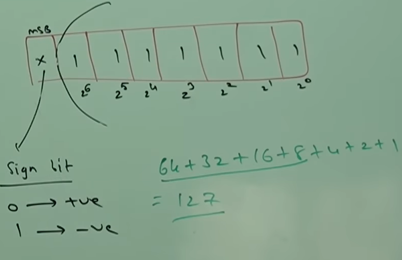
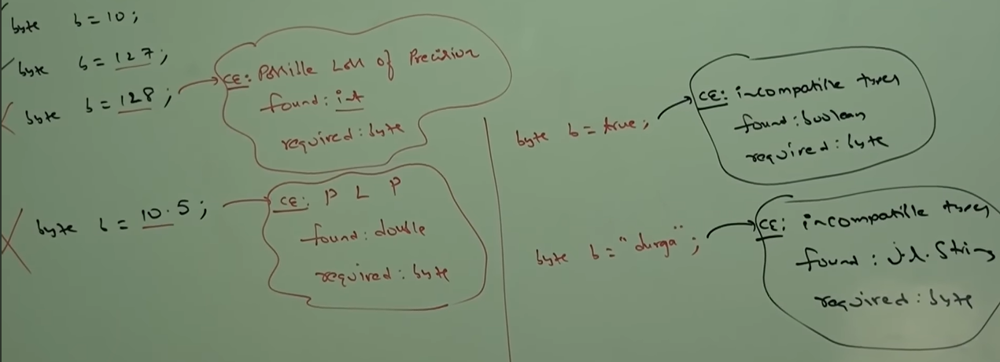

# Part - 2 & 3 - Data Types.

In java every var and every expression has some type (int, double,float).

Each and every data type is clearly defined

Every assignment should be checked by compiler for type compatibility

because of above reasons we can conclude that java is Strongly typed programming lang.

Java is not considered as pure object programming lang because several oops features are not satisfied by java(operator overloading, multiple inheritance etc).
Moreover we are depending on primitive data types which are non objects.

Except boolean and char all other data types are considered as Signed Data types. Because we can represent both positive and negative numbers.

**byte:**
    
    Size : 1 bytes(8 bits)
    
    Max value: +127
    
    Min value: -128
    
    Range: -128 to 127

The most significant bit (MSB) acts as sign bit.

Zero means positive number, 1 means negative number. Positive numbers will be represented directly in the memo. where as negative numbers will be represented in two's complements form.

**Two complements** : Is a binary representation system used by computers to store signed integers efficiently Negative numbers are represented by inverting bits and adding 1.

 

Byte is the best choice if we want to handle data in terms of streams.
Either from the files or from the network (files supported form and network form is the byte ).

**short** :

    Size: 2 bytes(16 bits)

    Range: 2^15 to 2^15 - 1 [-32768 to 32767]

    short is the most rarely used Data types in java.

    short data types are best suitable for 16bit processors like 8085 but these processors are outdated and hence short data type isn't used anymore.

**int** ;

    Size: 4 bytes(32 bits)

    Range: -2^32 to 2^32 -1 [-2147483648 to 2147483647]

    the most common used data types is int.

**long** :

    Size: 8 bytes(64)

    Range: -2^63 to 2^63-1
    
    long is used when int isn't enough to hold big values.

    The number of char present in big file may exceed "int" range hence the written type of length method is "long". (long l = f.length())

**Notes**:

All the above data types (byte, short, int, long) are meant for representing integral values only. If we want to represent floating point values floating point data types.

**Floating Point Data Types** :

**float** :

    Accuracy - if we want to 5 to 6 decimals point accuracy then we use float
    
    float follows Single precision
    
    Size: 4 bytes
    
    Range: -3.4e38 to 3.4e38 - 1

**double**:
    
    Accuracy - if we want 14 to 15 decimals point accuracy then use double,
    
    double follows double precision

    Size: 8 bytes

    Range: -1.7e38 to 1.7e38 -1

**boolean**:

    Size: Not Applicable in java it depends on the virtual machine dependency.

    Range: Not applicable, but allowed values are true/false

**char**:

    old languages are ascii code based under the number of diff allowed different ascii code characters are less than or equal to 256. TO represent 256 characters 8 bits (1 byte) is enough. hence the size of char in old languages are 1 bit.
    But java is Unicode based, and the number of different Unicode characters are greater than 256 and less than or equal to 65536 to represent this many characters 8 bits may not enough. Then we should go for 16bits (2bytes)

    Range: 0 to 65535