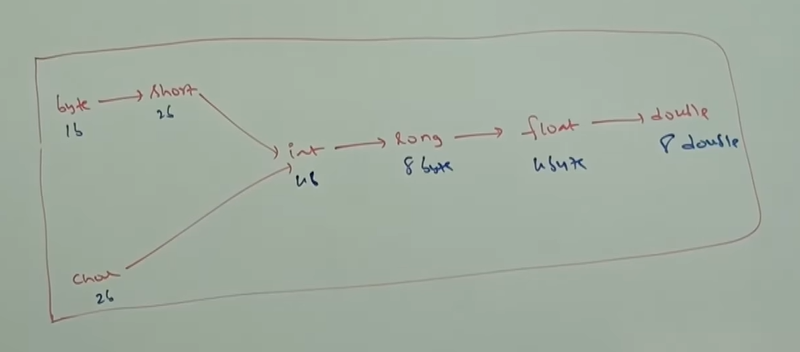

# Part - 4 & 5 - Literals

A constant value which can be assigned to the variable is called Literals.
    Eg. int x = 10; -> 10 is the constant value/literal.

**Integral Literals**

For integral data types (byte, short, int, long) we can specify literal in the following ways

1. Decimals Literals (base - 10) - allowed digits are 0 - 9
    eg int x = 10;

2. Octal Form (base - 8) - allowed digits are 0 - 7
   eg int x = 010; (literal value should be prefixed with "0")

3. Hexa decimal form (base - 16) -  allowed digits are  0- 9, a to f -> for extra digits we can use both uppercase and lowercase characters.    This is one of few areas where java isnt case sensitive
    eg int x = 0X10;

By default every integral letter is "int" type but we can specify explicitly as long type by suffixed with "l" or "L".

There's no direct way to specify byte and short - it can be done indirectly when ever we are assigning an integral value to the byte var and if the value is within the range of byte then compiler treats it as byte literally and same for short literal.
    
    byte b = 10;

    short s = 32767;

**Floating point literals** :

By default every floating point literal is of double type and we cant assigned it to float var. But we can speficiy floating point literal as float type by suffixing it with "F".
    float f = 123.456F;

We can specify floating point literal as double type by suffixing it by "d" or "D" but this is not req as  floating point literals are default double.

We can specify floating points literal only in decimals and we cant specify it in octal or hexa decimals points.

We cant assign floating points literals to integrals types
    eg - int x = 10.0; this will give PLP error.

**Escape characters** :

    \n - New line - Creates a new line.
            eg sop("heelo\nWorkd");

    \t - horizontal tab - Adds tab spacing
          - eg sop("Name\tAge");
    
    \r - carriage return - Moves cursor to start of line
          - eg sop("hello\rHi");
    
    \b - BackSpace - Removes prev character
          - eg sop("Helloo\b");
    
    \f - form feed - Almost never used today

    \' - Single quote - Needed inside character/string literals
         - eg sop("\'")

    \" - double quote - used in JSON, strings
         - eg sop("said \"Helllo\" ")

    \\ - back slash - Used to print one slash
        - eg sop("\\")
  
**String** :

Any sequence of characters within double quotes is quoted as String literals

**Binary Literals** :

Integral Literals can be turned into Binary literals by using "0b" or "0B"
Only (0,1) are allowed
    
    eg - int x = 0B.
 

We can assign the short data types to long no problem in that
