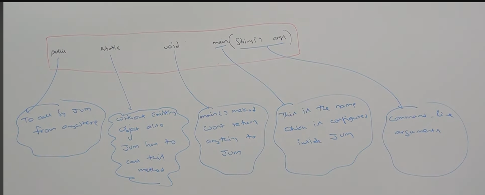

# Part 13, 14 & 15 - Main() method & Command Line Arguments

JVM start program execution from main() method.

Wether class contains main() or not and whether main() is declared according to required prototyp or not these things wont be checked by compiler. This is the responsibility of JVM, if JVM isn't able to find these then we get runtime exception -> NoSuchMethodError : main

At runtime JVM always searches for main() with the following prototype;
    

The above syntax is very strict and if we perform any change then we will get Runtime Exception -> NoSuchMethodError

The only changes can be made are :

1. Static public void main.... (the order of modifiers are not important)
2. main (String []args), main(String args[])
3. main (String[] durga)
4. main(String... args) - String array can be replaced with var-arg param.

We can declare main() with the following modifiers

1. final
2. synchronized
3. strictfp

```
eg - Class test{
    public final synchronized strictfp static void main(String... durga){
        Sop("valid main method")
    }
}
```

Overloading of the main() is possible but JVM will always call String array argument main() only the other overloaded method we have to call explicitly like normal method call

```
    class Test{

        public static void main(String[] args){
            
            Sop("String[]");
        
        }

        public static void main(int[] args){

            Sop("int[]");

        }
    }

OUTPUT -> String[]

```
Inheritance concept applicable for main method hence while executing child class if it doesn't contain main() then parent class main() will be executed

```
    Class P {
        public static void main(String[] args){
         
            Sop("parent main");
        
        }

    }

    class C extends P {

    }

OUTPUT -> parent main
```

**1.7 version enhancements** :

Until 1.6v if the class dosent contain main() then we will get runtime exception "NoSuchMethodError", but from 1.7v onwards instead of "NoSuchMethodError" we will get more elaborated error information

    eg - Main method not found in class test, please define main method as
                public static void main(String[] args)

From 1.7v onwards main() is mandatory to start the program execution hence even though class contain static block it wont be executed if the class doesn't contain main()

**Important Question**

Q1 - Why main() is public?

A - JVM should be able to access it from outside the class.

Q2 - Why main() is static?

A - JVM can call static methods without creating objects.

Q3 - Why main() is return type is void?

A - JVM does not expect any value from main method.

Q4 - Why String[] args?

A - Because it is used to receive command line arguments.

# Command Line Arguments

The arguments which are passed from command prompts are called Command line arguments, with these command line arguments JVM will create an array and by passing that array as argument JVM will main method.

The main objective of command line arguments is we can customize behavior of the main().

```
eg -
    class test{
        public static void main(){
            Sop(args[0]);
        }
    }

Execution : java test durga
Output : Durga
Why - because JVM creates -> String[] args = {"Durga};

```

Command line arguments are always string types
