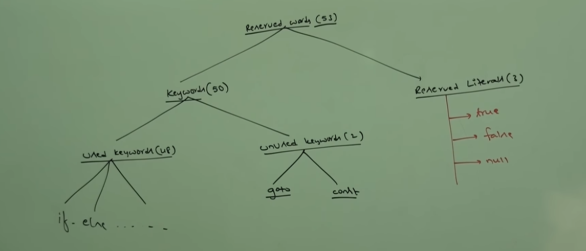

# Part - 1 Language Fundamentals 

A name in java program is called identifier which can be used for identification purposes.
    It can be method name, class name, variable name and label name (MVCL).

Eg -
 ```class test {
    public static void main(String[] args){
        int x = 10;
    }
}
```

Identifiers in this eg. total (5)

    1. test - class name.
    2. main - method name.
    3. String - Predefined java class name.
    4. args - array name.
    5. x - variable name.

**Rules for defining java identifiers**

    Allowed characters are:
        a to z
        A to Z
        0 to 9
        $
        -

If any other characters are used we will get compile time errors
Identifiers should not start with numbers/digits (eg - 123total)

Java identifiers are case sensitive - of course java lang is treated as case sensitive programming language. we can differentiate with Case.
```
    class Test{
        int number = 10;
        int Number = 10;
        int NUMBER = 10;
    }
```

Theres no length limit of java identifiers. but its not recommended that identifiers are too long as it decreases the readability of the code/program.

We cant use Reserved words as identifiers

    Eg - int **if** = 20;

All predefined java class names and interface names can be used as identifiers.

```
    Eg - class Test{
        public static void main(String[] main){
            int String = 999;
            System.out.println(String);
        }
    }

    class Test{
        public static void main(String[] main){
            int Runnable = 999;
            System.out.println(Runnable);
        }
    }
```

Even though its valid, but its not a good programming practice because code readability and creates confusions

which of the following are valid java identifiers

```
    total_number - valid
    total# - invalid
    123total - invalid
    total123 - valid
    ca$h - valid
    _$_$_$ - valid
    all@hands -invalid
    Java2Share - valid
    Integer - valid
    Int - valid
    int - invalid
```

**Reserved Words**

In java some words are reserved to represent some meaning and functionality such words are called reserved words.



1. goto - usage of goto created several problem in old languages and hence some people banned this keyword in java.
2. const - use of final instead const.
   these two are unused keyword and if you use this we will get compile time error.

true and false are values for boolean data types.

null = default value for object reference.

enum keyword - we can use enum to define a group of named constants.

Keywords for Data Types - (8)
    
    byte
    short
    int
    long
    double
    boolean
    char

Keywords for flow control - (11)

    if
    else
    switch
    case
    default
    while
    do
    for
    break
    continue
    return

Keywords for modifiers -(11)

    public 
    private
    protected
    static
    final
    abstract
    synchronized
    native
    strictfp
    transient
    volatile

Keywords for Exception handling -(6)

    try
    catch
    finally
    throw
    throws
    assert

Class related keywords -(6)

    class
    interface
    extends
    implements
    package
    import

Object related keywords -(4)

    new
    instanceof
    super
    this

In java return type is mandatory if a method wont return anything then we should declare the method with "void" return type.


**Conclusions**

    1. All 53 reserved keywords in java contain lowercase alphabets symbols
    2. In java we have only new keyword, and theres DELETE keyword - because destruction of useless objects is the responsibility of garbage collector.
 

