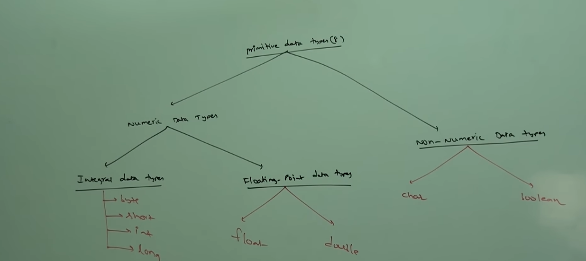

# Part - 2 - Data Types.

In java every var and every expression has some type (int, double,float). 

Each and every data type is clearly defined

Every assignment should be checked by compiler for type compatibility

because of above reasons we can conclude that java is Strongly typed programming lang. 

Java is not considered as pure object programming lang because several oops features are not satisfied by java(operator overloading, multiple inheritance etc).
Moreover we are depending on primitive data types which are non objects.

Except boolean and char all other data types are considered as Signed Data types. Because we can represent both positive and negative numbers.

**byte:**
    
    Size : 1 bytes(8 bits)
    
    Max value: +127
    
    Min value: -128
    
    Range: -128 to 127

The most significant bit (MSB) acts as sign bit.

Zero means positive number, 1 means negative number. Positive numbers will be represented directly in the memo. where as negative numbers will be represented in two's complements form.

**Two complements** : Is a binary representation system used by computers to store signed integers efficiently Negative numbers are represented by inverting bits and adding 1.

 

Byte is the best choice if we want to handle data in terms of streams.
Either from the files or from the network (files supported form and network form is the byte ).

**short** :

    Size: 2 bytes(16 bits)

    Range: 2^15 to 2^15 - 1 [-32768 to 32767]

    short is the most rarely used Data types in java.

    short data types are best suitable for 16bit processors like 8085 but these processors are outdated and hence short data type isn't used anymore.

**int** ;

    Size: 4 bytes(32 bits)

    Range: -2^32 to 2^32 -1 [-2147483648 to 2147483647]

    the most common used data types is int.

    