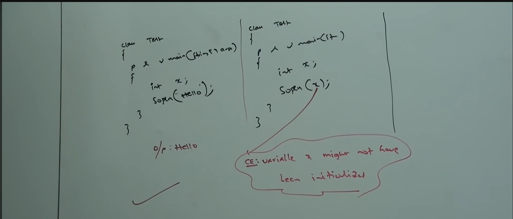
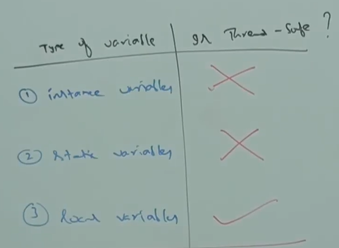

# Part - 10, 11 - Types of Variables

Based on the type of value represented by the variable all variables are divide into two types :
    
1. Primitive Variables - Used to represent primitive values.
    
    eg - int x = 10; -> x is the primitive variable.
    
2. Reference Variables - Used to store reference(addresses) of objects.
    
    eg - Student s = new Student(); -> s is the reference variable. and new Student(); is the object.
    

Based on position of declaration and behavior all variables are divided into three types (ISL) :

1. Instance Variables
    
2. Static Variables
    
3. Local Variables

**Instance Variables** :

1. Variables declared inside class and outside methods/constructor/block are called instance variables.

2. For every object a separate copy of instance variables will be created.

3. IV should be declared inside the class only. but outside of any method block or constructor.

4. Instance variables are created at the time of object creation, and is eligible for garbage collection when object becomes unreachable  hence the scope of IV is same as the scope of object.

5. IV will be stored in the heap memo as a part of object.

6. IV cant be accessed directly from static method but we can access by using object reference, but we can access IV directly from instance area.

```
    eg -
     class Test{
        int x = 10;

        public static void main(String[] args){
            Sop(x); -> This will give an error (non-static variable x cannot be referenced from static context)

            Test t = new Test();

            Sop(t.x) ; -> Output will be 10.
        }

        public void m1(){
            Sop(x); -> This will also give the value of x.
        }
    }
```

7. For IV if we don't init the variables JVM will provide default values and we are not requred to perform explicit

```
    eg - class Test{
        int x;
        double d;
        boolean b;
        String s;

        public static void main(String[] args){
            Test t = new Test();

            Sop(t.x) -> Output 0
            Sop(t.d) -> Output 0.0
            Sop(t.b) -> Output false
            Sop(t.s) -> Output null
        }
    }

```
8. IV are also known as Object Level or Attributes.

9. Single object can be accessed by multiple threads (Not thread safe).
    
**Static Variables** :

1. If a value of a variable does not vary from object to object then its not recommended to variable as IV, we have to declare such type of variables at class level using Static modifier.

2. Static member/variables are loaded before object creation 

```
    eg - class test{
        Static int x = 10;
    }
    
    x exists before any object is created.
```
3. In the case of IV for every object a separate copy will be created but in the case of static variables a single copy will be created at class level and shared by every object of the class.

4. Static variables should be declared directly in the class but outside of any method, block or constructor

5. SV will be created at the time of class loading and destroyed at time of class unloading, hence scope of SV is exactly same as scope of class.

6. SV are stored in method area.

7. We can access SV either by object reference or class name but its recommended tp access it by class name, withtin the same class it is not req to use class name and we can access directly.

```
    eg - class Test{

        Static int x = 10;

        Static void main (String[] args){
            Test t = new Test();
            Sop(t.x); - valid but not recommended
            Sop(Test.x); - valid
            Sop(x); - also valid
        }
    }

```

7. We can access SV from both instance and static areas.

```
   eg - class Test{
        Static int x = 10;

        Static void main(String[] args){
            Sop(x);
        }

        public void m1(){
            Sop(x);
        }
   }

```

8. If we don't init SV the JVM will provide the default values.

```
    eg - class Test{
        static int n;
        static double d;
        static String s;

        public static void main(String[] args){
            Sop(n); -> Output = 0
            Sop(n); -> Output = 0.0
            Sop(n); -> Output = null
        }
    }

```

9. SV are also know as class variables or fields.

10. Only one copy will be created at class level and that copy can be accessed by multiple threads at a time. (Not thread safe)

**Local Variables** :

1. Variables declared inside methods, constructors or blocks are called Local Variables.

2. Local Variables are stored in stack memory and JVM doesn't not init them automatically.

3. Other names are Temporary,Stack & Automatic variable.

4. LV are stored in Stack memory,

5. Lv will be created while executing the block in which its declared, once the block execution is completed the LV will be destroyed when the block is destroyed its declared in.

6. For LV JVM doesn't provide default values. We should perform init explicitly before using it. If we are not using LV then init is not req.
    


The first eg shows that we don't get any compile time errors as we aren't using LV, But in the other eg we have a compile time error because we have used the LV without it being init.

6. It is highly recommended to perform init for LV at the time of declaration at least with default values.

7. The only applicable modifier for LV is final.

```
    eg - public static void main{String[] args}{

        final int x = 10;

    }
```

**Static methods** :

Static methods cannot directly access instance variables because static methods belong to class, while instance variables belongs to objects.

**Imp Question** :

Q - Can local variables be static?

A - No, because static belongs to class level, while local variables belong to method/block.

**Conclusion** :

For Instance and Static variables JVM will provide default values, and we are not required to init but for local variables JVM wont provide default values so we should perform init before using the variable.

IV and SV can be accessed by multiple threads simultaneously and hence these are not threat safe, but in the case of local variable for every thread a separate copy will be created and hence LV are generally thread-safe because each thread gets its own separate copy stored in stack memory.



Every variable in java should be either Instance, Static or Local. Every variable in java should be either primitive or reference hence various possible combinations of variables in java are:
```
    eg -
        class Test{
            int x = 10;  -> instance - primitive

            Static String s = "durga"  -> Static - Reference

            public static void main(String[] args){
                
                int[] y = new int[3];  -> Local - Reference
            
            }
        }
```